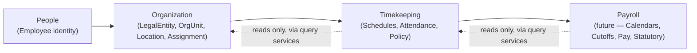
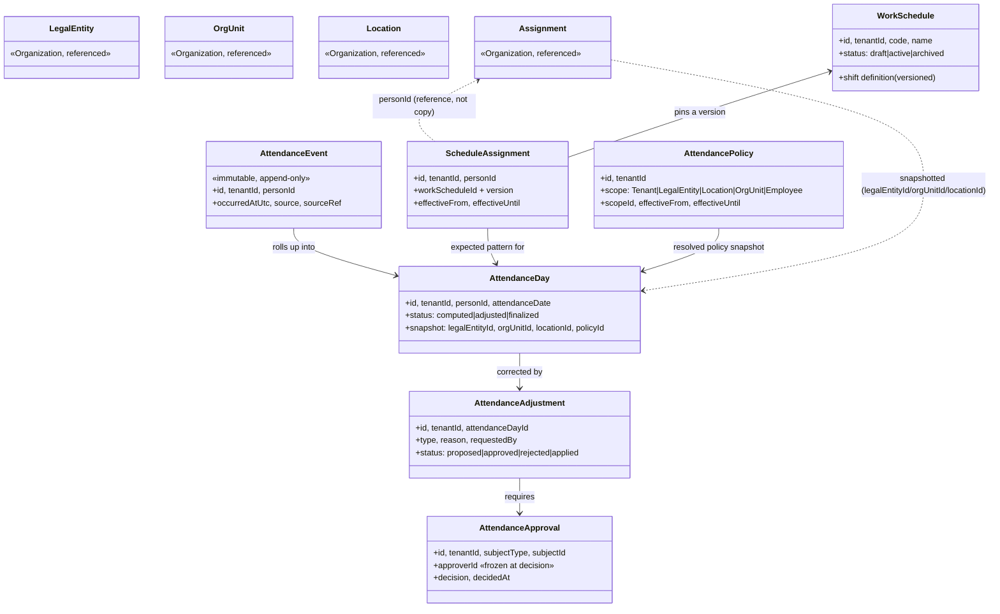
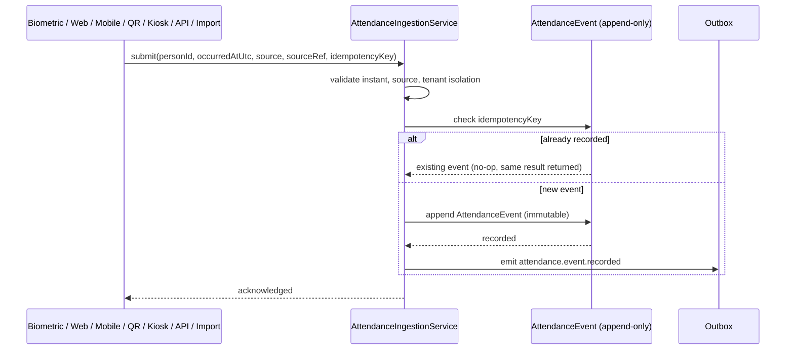
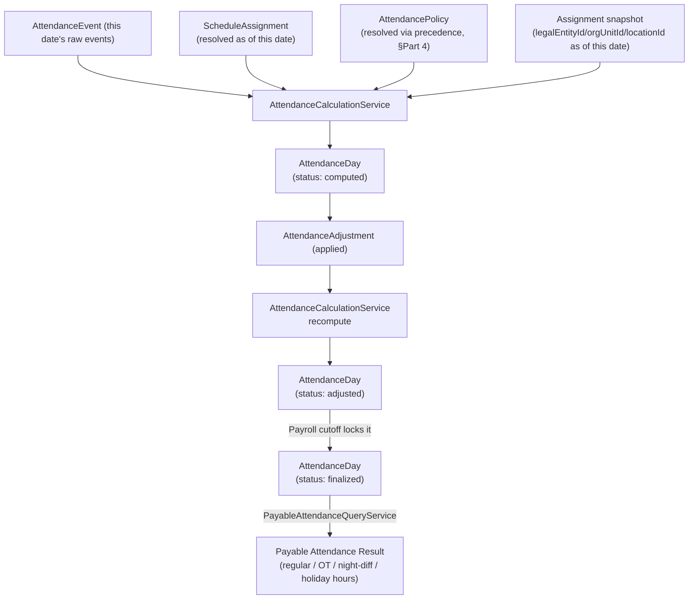
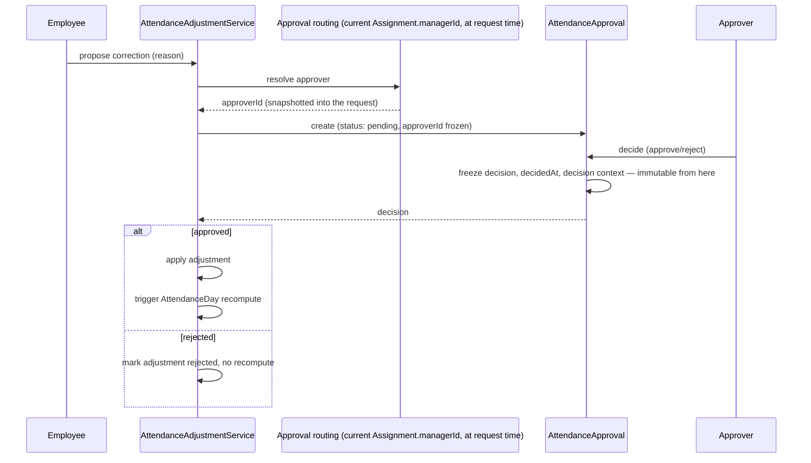
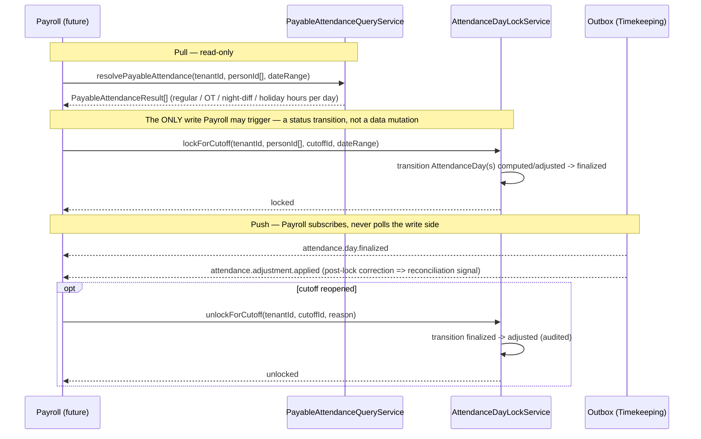

# ADR-014: Timekeeping Temporal and Policy Model

| | |
|---|---|
| **Status** | Proposed |
| **Date** | 2026-07-25 |
| **Depends on** | ADR-012 (Organization Domain); ADR-013 (Legal Entity as a First-Class Aggregate) |
| **Governs** | Every future Timekeeping implementation slice |
| **Related** | AURA Engineering Constitution v1.0 (§4 Engineering Principles, §11 Non-Negotiables) |

This ADR records architectural decisions only. It defines no schema, API, UI,
code, or migration — those are implementation slices governed by this
document, not part of it. Where a future implementation and this document
disagree, this document wins, or it is amended deliberately with a version
bump. No Timekeeping code exists yet; this is the architecture review that
must precede it.

---

## 1. Context

AURA has just adopted Legal Entity (ADR-013) as a peer Organization aggregate
alongside OrgUnit, Location, and Assignment, specifically so the platform can
represent one tenant operating as multiple employers of record before
Timekeeping or Payroll ship. Timekeeping is the next bounded context, and it
is the first one that must work **globally** from its first line of code —
multiple countries, multiple Legal Entities, varying statutory work-week and
overtime rules, and a Payroll integration that does not exist yet but whose
shape must already be respected.

Getting this wrong is expensive in a way most slices are not: attendance
records are financial-adjacent (they become pay), historically sensitive (a
payroll audit may need to reproduce a computation from a year ago exactly as
it was), and high-volume (biometric devices, mobile clock-ins, and imports
can produce thousands of raw events per tenant per day). A temporal model or
policy hierarchy chosen carelessly now is not something a later slice can
cheaply undo, because by then real payroll-consumed history depends on it.

## 2. Problem Statement

Three failure modes must be designed out from the start, not patched in
later:

1. **Country/entity bias.** A model built implicitly around one country's
   rules (e.g., assuming a single national holiday calendar, a single
   statutory work week, or that Location always determines timezone) would
   have to be re-architected — not extended — the moment a second country or
   a traveling/remote employee appears. AURA's own Legal Entity work exists
   because that mistake was almost repeated in Organization; Timekeeping must
   not repeat it a second time.
2. **Coupling to Payroll.** Timekeeping must be usable, valuable, and
   testable with no Payroll bounded context present at all (Payroll does not
   exist yet). Anything designed as "Timekeeping writes directly into
   Payroll's tables" or "Payroll writes directly into Timekeeping's tables"
   fails this requirement immediately and is rejected outright (§9).
3. **Historical correctness under correction.** Attendance, unlike most of
   AURA's data so far, is corrected *after the fact* routinely — a forgotten
   clock-out, a late-approved overtime request, a manager who only reviews
   exceptions weekly. The temporal model must make "what was true, and what
   was payable, as of a given computation" a first-class, reproducible
   question, not an emergent property of whatever the current row happens to
   contain.

## 3. Decision — Timekeeping is an independent bounded context, downstream of People and Organization, upstream of Payroll

Timekeeping is adopted as a new bounded context, peer to People and
Organization, with a strict one-directional dependency chain:

No arrow ever points backward. Organization has zero knowledge Timekeeping
exists. Timekeeping has zero knowledge Payroll exists beyond a narrow,
explicitly-designed contract (§9) that Timekeeping satisfies without
importing anything from a Payroll package. This mirrors the dependency
discipline ADR-012 already established between People and Organization
(People does not know Assignment exists as a concept, Organization does not
mutate Employee).

### 3.1 Domain ownership — what belongs where

| Concern | Owner | Notes |
|---|---|---|
| Employee identity, personal/contact info | **People** | Unchanged by this ADR. |
| Who reports to whom, in which Legal Entity, at which Location, over time | **Organization** | `Assignment` (ADR-012, ADR-013) — Timekeeping reads this, never re-derives it. |
| Legal employer of record, country | **Organization** (`LegalEntity`) | Timekeeping reads `countryCode` for statutory defaults; never stores its own copy of legal entity facts. |
| Expected work pattern (shifts, work days, breaks) | **Timekeeping** (`WorkSchedule`) | |
| Binding of a schedule to a person, over time | **Timekeeping** (`ScheduleAssignment`) | |
| Raw fact of a clock-in/out | **Timekeeping** (`AttendanceEvent`) | Immutable. |
| Computed daily attendance result | **Timekeeping** (`AttendanceDay`) | |
| Corrections to a computed day | **Timekeeping** (`AttendanceAdjustment`) | |
| Sign-off on corrections/overtime/exceptions | **Timekeeping** (`AttendanceApproval`) | |
| Grace period, rounding, OT thresholds, break rules, tolerance | **Timekeeping** (`AttendancePolicy`) | |
| Timezone, holiday calendar *data* | **Timekeeping**, sourced from Location/LegalEntity facts | See §5 — Timekeeping owns resolution, not the raw facts. |
| Payroll calendars, cutoff periods | **Payroll** (future) | Not designed in this ADR beyond the contract in §9. |
| Pay computation, statutory computation (tax/contributions) | **Payroll** (future) | Never Timekeeping's concern. |

### 3.2 Bounded context inventory

**Aggregates** (designed in full in Part 2 / §4): `WorkSchedule`,
`ScheduleAssignment`, `AttendanceEvent`, `AttendanceDay`,
`AttendanceAdjustment`, `AttendanceApproval`, `AttendancePolicy`.

**Domain services** (one per write surface, mirroring the
`OrgUnitService`/`AssignmentService`/`LegalEntityService` pattern already
established in Organization — thin, permission-gated, transaction-owning):

- `ScheduleService` — create/version `WorkSchedule`; open/end
  `ScheduleAssignment` (transfer-shaped, never edits in place — §6).
- `AttendanceIngestionService` — the single write path for `AttendanceEvent`,
  idempotent per source+sequence (§6).
- `AttendanceCalculationService` — computes/recomputes `AttendanceDay` from
  events + schedule + policy (§7).
- `AttendanceAdjustmentService` — proposes and, once approved, applies
  `AttendanceAdjustment`.
- `AttendanceApprovalService` — routes and records `AttendanceApproval`
  decisions (§8).
- `AttendancePolicyService` — defines `AttendancePolicy` records and resolves
  precedence (§4 [Part 4]).

**Repositories** — one write repository and one read repository per
aggregate, following the existing ports-plus-Prisma-plus-in-memory pattern
(`*Repository` interface, `Prisma*Repository`, `InMemory*Repository`,
`*UnitOfWork`) already used for every Organization aggregate. `AttendanceEvent`'s
repository is **append-only** — no `update`, no `delete`, structurally
enforced the same way `TransferInput` structurally cannot carry
`legalEntityId` today (ADR-013 §3).

**Query services** — two, deliberately kept narrower than the write side,
mirroring how `OrganizationQueryService` is already kept separate from
`AssignmentService`:

- `TimekeepingQueryService` — internal-facing (`resolveAttendanceDay`,
  `resolveScheduleForPerson`, `resolveCurrentPolicy`, `resolveApprovalQueue`).
- `PayableAttendanceQueryService` — the **entire** Payroll-facing surface
  (§9). Payroll is never given access to `TimekeepingQueryService` or any
  write service.

**Events** (outbox pattern, matching the existing
`organization.legal_entity.created`-style domain events and the existing
outbox worker): `schedule.work_schedule.created`,
`schedule.work_schedule.archived`, `schedule.assignment.created`,
`schedule.assignment.ended`, `attendance.event.recorded`,
`attendance.day.computed`, `attendance.day.recomputed`,
`attendance.day.finalized`, `attendance.adjustment.proposed`,
`attendance.adjustment.applied`, `attendance.approval.decided`,
`policy.attendance_policy.changed`.

**External dependencies** (inbound reads only): People (`Employee` identity,
via the existing People read models), Organization
(`OrganizationQueryService.resolveCurrentPlacement`/`resolveAssignmentHistory`
for `legalEntityId`/`orgUnitId`/`locationId`/`managerId`, `LegalEntity` for
`countryCode`). **Zero outbound dependency on Payroll** — Payroll depends on
Timekeeping, never the reverse.

## 4. Core Aggregates [Part 2]

All seven aggregates follow the lifecycle discipline already established for
every Organization aggregate: tenant-scoped, immutable audit trail on every
write, soft lifecycle (archived, never hard-deleted), stable
`id`/identity fields never reused, and — critically — **never edited in
place** where the edit would change the meaning of a past instant. Where an
aggregate needs to change over time, it is effective-dated (opens a new
record, ends the old one) rather than mutated, exactly as `Assignment.transfer()`
already does.

### 4.1 WorkSchedule

- **Purpose.** A reusable, named template of expected work: shift start/end,
  work days, break windows, and its own timezone-resolution mode (fixed zone,
  or "resolve from the wearer's effective Location" — §5).
- **Identity.** `id`, `tenantId`, `code` (stable, human-referenceable, like
  `OrgUnit.code`/`Location.code`).
- **Lifecycle.** `draft` → `active` → `archived`. **Editing a WorkSchedule's
  shift definition creates a new version; it never mutates a version already
  referenced by a live or historical `ScheduleAssignment`.** This is the same
  invariant Assignment already enforces for placement — a definition that
  computed a payable result for January must still compute that same result
  if read again in December.
- **Invariants.** Break windows must fall within shift bounds; a declared
  timezone-resolution mode is mandatory (no undefined default); archiving a
  version in active use by a live `ScheduleAssignment` is rejected, mirroring
  `LegalEntity`/`Location` archive-in-use protection.
- **Effective dating.** The template itself is versioned, not
  period-effective; the *binding* to a person is what's effective-dated
  (`ScheduleAssignment`).
- **Ownership.** Timekeeping.
- **Relationships.** Referenced by many `ScheduleAssignment` records across
  many people; optionally scoped to a `LegalEntity` or `Location` as a
  default suggestion only — a `WorkSchedule` never *owns* placement.

### 4.2 ScheduleAssignment

- **Purpose.** The effective-dated binding of one `WorkSchedule` version to
  one person — "what this person is expected to work, starting when."
- **Identity.** `id`, `tenantId`, `personId`, `workScheduleId`
  (+ version), `effectiveFrom`, `effectiveUntil?`.
- **Lifecycle.** Never edited in place. A schedule change ends the current
  `ScheduleAssignment` and opens a new one — the exact shape of
  `AssignmentService.transfer()` today.
- **Invariants.** Non-overlapping per person (the same
  exclusion-constraint discipline as `Assignment`'s GIST constraint);
  `effectiveFrom` must fall within the person's own current `Assignment`
  placement window — **a person cannot be scheduled before their placement
  begins or after it ends.** This is the one hard cross-aggregate invariant
  tying Timekeeping to Organization, and it must be enforced server-side at
  write time, not assumed.
- **Effective dating.** Core to the aggregate.
- **Ownership.** Timekeeping.
- **Relationships.** References `personId` (People) directly; resolves the
  person's current `legalEntityId`/`orgUnitId`/`locationId` **by calling**
  `OrganizationQueryService` at read/compute time — it does **not** store a
  redundant copy of those fields (§6 resolves the reference-vs-snapshot
  question per aggregate; this one is a pure reference).

### 4.3 AttendanceEvent

- **Purpose.** The atomic, immutable fact: "this person's [device/app]
  registered a punch at this instant." The sole input to everything
  downstream.
- **Identity.** `id`, `tenantId`, `personId`, `occurredAtUtc` (a real UTC
  instant, never a bare local-time string), `source`
  (`biometric`|`web`|`mobile`|`qr`|`kiosk`|`api`|`import`), `sourceRef`
  (device id / import batch id / API caller), `receivedAtUtc` (server
  receipt time, kept distinct from `occurredAtUtc` — see §11 device-clock
  risk).
- **Lifecycle. Create-only.** Never updated, never deleted. A wrong punch is
  corrected exclusively through `AttendanceAdjustment` against the
  `AttendanceDay` it rolled into — the raw fact itself is permanent audit
  trail, the same "append, never rewrite" philosophy as `Assignment`'s own
  history and the platform's immutable audit pipeline.
- **Invariants.** `occurredAtUtc` must be a real, parseable instant;
  `source` must be a declared channel; an idempotency key
  (`source` + `sourceRef` + device sequence number, or an explicit
  client-supplied idempotency token for API/mobile) prevents duplicate
  events from retried submissions — biometric devices and flaky mobile
  connections both retry.
- **Effective dating.** None — a point-in-time fact, not a period.
- **Ownership.** Timekeeping.
- **Relationships.** Many `AttendanceEvent` records roll up into one
  `AttendanceDay`.

### 4.4 AttendanceDay

- **Purpose.** The computed, per-person-per-calendar-date aggregation of that
  date's `AttendanceEvent` records into a structured result (first-in,
  last-out, break duration, worked minutes) — the record `AttendanceAdjustment`
  attaches to, and the unit Payroll ultimately consumes.
- **Identity.** `id`, `tenantId`, `personId`, `attendanceDate` (a calendar
  date, resolved in the effective timezone for that day — §5), `status`
  (`computed` → `adjusted` → `finalized`).
- **Lifecycle.** Computed (derived, freely recomputable while `computed`) →
  `adjusted` (an `AttendanceAdjustment` has been applied) → `finalized`
  (locked once a Payroll cutoff has consumed it — locking is triggered by
  Payroll through the §9 contract, not by Timekeeping's own clock). A
  `finalized` day cannot be silently recomputed; unlocking requires an
  explicit, permissioned, audited action (§11).
- **Invariants.** Exactly one `AttendanceDay` per person per `attendanceDate`
  (uniqueness); a `finalized` day rejects further `AttendanceAdjustment`
  proposals unless explicitly reopened.
- **Effective dating.** Pinned to a single date; recomputation is bounded by
  lock state (§6).
- **Ownership.** Timekeeping.
- **Relationships / the snapshot decision (§6 preview).** `AttendanceDay`
  **snapshots** — does not merely reference — the `legalEntityId`,
  `orgUnitId`, `locationId` that were in force on that date (resolved once,
  at computation time, from `Assignment`), and the resolved
  `AttendancePolicy` id/values used for that computation. This is a
  financial-adjacent record; its meaning must never silently change because
  someone was transferred six months later. See §6 for the full
  reference-vs-snapshot rule.

### 4.5 AttendanceAdjustment

- **Purpose.** A human-authored, reasoned, audited correction to an
  `AttendanceDay` — "forgot to clock out," "approved late arrival exception."
  Never a silent mutation of the computed result.
- **Identity.** `id`, `tenantId`, `attendanceDayId`, `adjustmentType`,
  `reason`, `requestedBy`.
- **Lifecycle.** `proposed` → (`AttendanceApproval` decides) →
  `approved`/`rejected` → `applied`. Once `applied`, the adjustment record
  itself is immutable; a further correction is a **new** `AttendanceAdjustment`
  referencing the same `AttendanceDay`, never an edit to a prior one — the
  full correction history is always reconstructable.
- **Invariants.** Cannot target a `finalized` `AttendanceDay` without an
  explicit reopen (§9 — this is a boundary decision Payroll must be party to,
  not Timekeeping's alone); must carry `reason` and a resolvable
  `requestedBy`.
- **Effective dating.** Targets one specific date; not itself a period.
- **Ownership.** Timekeeping.
- **Relationships.** Many-to-one with `AttendanceDay`; one-to-one with the
  `AttendanceApproval` that decided it.

### 4.6 AttendanceApproval

- **Purpose.** The maker-checker record for anything requiring sign-off:
  overtime, corrections, schedule changes, official business, work-from-home,
  undertime.
- **Identity.** `id`, `tenantId`, `subjectType`
  (`adjustment`|`overtime`|`schedule_change`|`official_business`|`wfh`|`undertime`),
  `subjectId`, `approverId`, `decision`, `decidedAt`.
- **Lifecycle.** `pending` → `approved`/`rejected`. **Frozen once decided.**
  `approverId` and the org context used to route the request are captured
  **at decision time** and never re-derived afterward — a later manager
  reassignment must not rewrite who approved what, and must not make a
  historical approval appear to have come from someone who was never asked.
  This is an explicit requirement, not an implementation detail: the
  approval record is a legal/audit artifact, not a live-computed view.
- **Invariants.** `approverId` must have been a valid approver for the
  subject, per routing policy, **at the time the request was routed** (not
  re-validated retroactively); an approver cannot decide their own request
  (mirrors `Assignment`'s self-manager rule).
- **Effective dating.** None — a decision event. It records the org context
  "as of decision time" for audit fidelity, but is not itself a period.
- **Ownership.** Timekeeping.
- **Relationships.** One `AttendanceApproval` per subject (recommend one
  concrete aggregate per `subjectType` rather than a single polymorphic
  table, for the same reason `AssignPrimaryInput`/`TransferInput` are
  distinct types today — different subjects validate and route differently;
  a shared `subjectType`/`subjectId` pair is the query-time correlation, not
  a shared write model).

### 4.7 AttendancePolicy

- **Purpose.** The configurable, scoped rule set — grace period, rounding,
  overtime thresholds, break rules, attendance tolerance — that governs how
  `AttendanceEvent` records become an `AttendanceDay` result.
- **Identity.** `id`, `tenantId`, `scope`
  (`Tenant`|`LegalEntity`|`Location`|`OrgUnit`|`Employee`), `scopeId`,
  `effectiveFrom`, `effectiveUntil?`.
- **Lifecycle.** Versioned and effective-dated — a policy change opens a new
  record, never mutates the old one, so a historical `AttendanceDay`
  computation stays reproducible against the policy that actually applied
  when it was computed.
- **Invariants.** At most one active policy per `scope` + `scopeId` at a
  given instant (same overlap-prevention discipline as `Assignment` and
  `ScheduleAssignment`); precedence resolution across scopes is deterministic
  (§ Part 4 / §8 below).
- **Effective dating.** Core to the aggregate.
- **Ownership.** Timekeeping.
- **Relationships.** Resolved via precedence at `AttendanceDay` computation
  time; the resolved policy id and the specific values used are snapshotted
  onto the `AttendanceDay` (§4.4), never re-resolved after the fact for an
  already-computed day.

## 5. Temporal Model [Part 3]

### 5.1 Effective dating

Every aggregate that represents "what's true, over time" (`ScheduleAssignment`,
`AttendancePolicy`) follows the exact pattern `Assignment` already
established: `effectiveFrom` inclusive, `effectiveUntil` exclusive-or-absent,
never edited in place, a change opens a new record and closes the old one,
and a new `effectiveFrom` must be strictly after the record it supersedes'
own `effectiveFrom` — the identical rule this session's own verification
independently confirmed the server enforces for `Assignment` today
("transfer date must be after the current placement's start date").

### 5.2 Overlapping periods

Non-overlap is enforced the same way `Assignment` enforces it today: a
database-level exclusion constraint (the existing GIST-exclusion pattern)
per `(tenantId, personId)` for `ScheduleAssignment`, and per
`(tenantId, scope, scopeId)` for `AttendancePolicy`. This is a database
invariant, not an application-level check alone — the same reasoning that
put the constraint in the original Assignment migration applies without
modification here.

### 5.3 Historical resolution

"What applied on date X" must always be answerable by querying the
effective-dated record whose window contains X — never by reading "the
current" record and assuming it always applied. `AttendanceCalculationService`
resolves `ScheduleAssignment` and `AttendancePolicy` **as of the
`attendanceDate` being computed**, not as of "now."

### 5.4 Snapshot vs. live reference — the rule, stated once

This is the single most consequential temporal decision in this ADR, so it
is stated as one explicit rule rather than left implicit per-aggregate:

> **A record snapshots a fact the instant that fact becomes financially or
> legally consequential and is expected to survive later, unrelated changes
> unchanged. A record references a fact live when the record's own purpose
> is to always reflect current truth.**

Applying it:

| Record | Reference or snapshot | Why |
|---|---|---|
| `ScheduleAssignment` → person's placement | **Reference** (calls `OrganizationQueryService` live) | Its only job is "who is this schedule for, right now" — it has no independent financial meaning. |
| `AttendanceDay` → `legalEntityId`/`orgUnitId`/`locationId` | **Snapshot**, taken once at computation time | The moment an `AttendanceDay` is computed, it becomes the payable-hours record for a specific employer, cost center, and site *as of that date*. If the person is transferred next month, last month's `AttendanceDay` must still show last month's employer — payroll history must never retroactively change because of an unrelated later transfer. |
| `AttendanceDay` → resolved `AttendancePolicy` | **Snapshot** (id + the resolved values) | Reproducibility: a payroll audit six months later must be able to answer "what rounding rule produced this number" without needing the policy history to still be intact or unambiguous at that scope. |
| `AttendanceApproval` → `approverId` and routing context | **Snapshot**, frozen at decision | Stated explicitly in §4.6 and Part 8 — a manager change must never rewrite who approved what. |
| `AttendanceAdjustment` → `attendanceDayId` | **Reference** | It is inherently about mutating that specific day's state; there is nothing to snapshot independently of the day itself. |

### 5.5 Retroactive corrections

An `AttendanceAdjustment` against a `computed`/`adjusted` (not yet
`finalized`) `AttendanceDay` triggers a full recompute of that day from its
`AttendanceEvent` set plus the adjustment, using the **policy snapshot
already on the day** (not a freshly re-resolved policy — see §5.4's
reproducibility rationale) unless the adjustment itself explicitly targets
the policy resolution (an open decision, §14).

### 5.6 Recalculation boundaries

- `computed` → freely recomputable (e.g., a late-arriving `AttendanceEvent`
  from an offline-then-synced mobile device).
- `adjusted` → recomputable, but every recompute is itself an audited event
  (`attendance.day.recomputed`), never silent.
- `finalized` → **not** recomputable without an explicit unlock, which is a
  privileged, audited action requiring the Payroll-side reason the day needs
  to be reopened (§9, §11). A `finalized` day that is unlocked reverts to
  `adjusted`, not `computed` — its history is preserved, not discarded.

## 6. Policy Model [Part 4]

### 6.1 The proposed hierarchy — accepted, with one required refinement

> Tenant → Legal Entity → Location → Organization (OrgUnit) → Employee Override

**Accepted as the general precedence order**, with a distinction the
proposal doesn't yet make explicit and that this ADR requires:

**Not every policy axis is a pure "more specific wins" override chain.**
Two of the listed axes are *statutory facts*, not operational preferences,
and must be modeled as a **floor**, not a freely overridable value:

- **Work week** and **overtime thresholds** are frequently mandated by the
  Legal Entity's country of registration (via `LegalEntity.countryCode`).
  A `Location`, `OrgUnit`, or `Employee Override` may **tighten** these
  (offer more favorable terms) but must never be allowed to **loosen** them
  below the Legal-Entity-derived statutory floor. This must be enforced in
  `AttendancePolicyService`, not left to admin discipline.
- **Grace period, rounding, break rules, attendance tolerance** are pure
  operational convenience with no compliance floor and may be freely
  overridden at any more-specific scope, exactly as the proposed hierarchy
  states.

With that refinement, the hierarchy is accepted as written for the
override-precedence *order*; §6.2 explains why **Legal Entity outranks
Location**, and §7 explains why **timezone and holiday calendar are
exceptions to this hierarchy entirely**, not instances of it.

### 6.2 Why Legal Entity outranks Location

A Location is a physical/administrative site; a Legal Entity is the legal
employer whose country's labor law actually governs statutory work-week and
overtime rules. Two Locations can share one Legal Entity (common), and in a
shared-services building, one Location can even (per ADR-013 §4) host
employees of *different* Legal Entities. Statutory rules must follow the
employer, not the building — so Legal Entity must sit above Location in the
hierarchy, exactly as proposed.

### 6.3 Resolution algorithm

For a given policy axis and a given `AttendanceDay` being computed,
`AttendancePolicyService` resolves the **most specific scope that has an
active `AttendancePolicy` record for that axis** at the target date,
walking `Employee → OrgUnit → Location → LegalEntity → Tenant`, stopping at
the first match. For the two statutory axes (§6.1), the resolved value is
then clamped against the Legal-Entity-derived floor before being applied —
never silently substituted, so an over-permissive override is a rejected
write, not a quietly-corrected one.

## 7. Timezone Model [Part 5]

**"Location determines timezone" is explicitly rejected as the sole rule.**
It is a reasonable *default*, never a hard source of truth — remote work,
travel, and multi-Location shared roles all break it.

### 7.1 Distinct timezone concepts

| Concept | Purpose | Default source | Override |
|---|---|---|---|
| **Schedule timezone** | What "9am–5pm" in a `WorkSchedule` actually means | The wearer's effective `Location` (via current `Assignment`) at `ScheduleAssignment` creation | Explicit per-`ScheduleAssignment` override (e.g. temporary travel assignment) |
| **Attendance/event bucketing timezone** | Which calendar date an `AttendanceEvent` belongs to, for `AttendanceDay` purposes | The effective schedule timezone for that person/date | Same override chain as schedule timezone — the two should not silently diverge |
| **Employee "home" timezone** | Explicit person-level default when Location doesn't reflect where they actually work (e.g. remote hire recorded against an HQ Location) | Not inferred — a distinct, explicit field | Set directly; takes precedence over the Location default when present |

**Resolution precedence for a given attendance date:** explicit
`ScheduleAssignment` override for that date → explicit Employee "home
timezone" → current `Assignment`'s `Location` timezone → `LegalEntity`'s
registered country timezone (last-resort fallback, e.g. a brand-new hire
with no `Location` set yet).

### 7.2 What must never happen

A device's local clock is untrusted and spoofable. `AttendanceEvent.occurredAtUtc`
is always the device-reported instant converted to UTC at ingestion (with
`receivedAtUtc` kept alongside for drift detection, §11); it is never stored
as a bare local-time string with an assumed offset.

### 7.3 DST handling

All instants are stored in UTC. Local wall-clock time (for display, for
"which calendar date," for shift-boundary comparisons) is resolved at
**read/compute time** via IANA timezone database lookups against the
resolved timezone for that date — never a fixed UTC offset cached at write
time. This means a DST transition is computed correctly and reproducibly no
matter when the computation runs, matching the ISO-8601-instant discipline
`Assignment` already uses platform-wide.

## 8. Attendance Ingestion [Part 6]

`AttendanceIngestionService` is the single write path for every channel —
biometric, web clock, mobile, QR, kiosk, API, and bulk import all call the
same service, differing only in `source`/`sourceRef` and how the event
reaches it (synchronous call vs. a queue-backed batch import worker for
high-volume channels).

`AttendanceEvent` is immutable by construction — the repository exposes no
update or delete method, structurally, the same way `TransferInput` today
has no `legalEntityId` field at all (ADR-013 §3): the invariant is enforced
by what the type system allows, not by convention alone.

## 9. Attendance Calculation [Part 7]

Recomputation happens in exactly two places, both explicit and both
audited: (1) `AttendanceCalculationService` itself, when new
`AttendanceEvent` records arrive for an already-computed, not-yet-`finalized`
day; (2) `AttendanceAdjustmentService`, immediately after an adjustment is
`applied`. **No other code path ever writes to `AttendanceDay`.** Payroll
triggers the `computed`/`adjusted` → `finalized` transition through the §9
contract; it never computes a payable result itself and never writes into
`AttendanceDay` directly.

## 10. Approvals [Part 8]

**Explicit routing decision (this ADR resolves it, rather than leaving it
open):** approval routing resolves the approver from the requester's
**current** `Assignment.managerId` at the moment the request is submitted,
and freezes that `approverId` onto the pending `AttendanceApproval`
immediately. **If the manager changes while the approval is still pending,
the pending approval is not silently reassigned to the new manager** — it
stays with the originally-routed approver unless an admin explicitly
reassigns it through a distinct, audited reassignment action. This avoids a
financial-adjacent decision silently changing hands, and is consistent with
§4.6's "frozen once decided" rule extended one step earlier, to "frozen once
routed."

This same aggregate and routing rule covers every listed subject —
overtime, attendance correction, schedule change, official business,
work-from-home, undertime — with one `AttendanceApproval` record per
subject (§4.6), so a future subject type is additive, not a redesign.

## 11. Payroll Boundary [Part 9]

Payroll does not exist yet. This ADR defines the contract Timekeeping must
already satisfy so Payroll's eventual arrival requires **new Payroll-side
code only**, never a Timekeeping redesign.

### 11.1 Ownership split (restated from §3.1)

**Timekeeping owns:** attendance ingestion, schedules, policies, and
`AttendanceDay` computation — the payable-hours *result*.
**Payroll owns:** payroll calendars, cutoff periods, pay computation
(rate × hours), and statutory computation (tax/contributions). Payroll turns
Timekeeping's hours into money; Timekeeping never sees a currency amount, a
pay rate, or a tax table.

### 11.2 The contract (conceptual — no code, no schema)

- **Query (pull, read-only):** `PayableAttendanceQueryService.resolvePayableAttendance`
  is the entire read surface. It returns computed hours broken down by type
  (regular, overtime, night differential, holiday — the exact breakdown is
  an implementation-slice decision, not this ADR's), never a raw
  `AttendanceEvent`/`AttendanceDay` row.
- **Command (the one write, a status transition only):**
  `AttendanceDayLockService.lockForCutoff` / `unlockForCutoff`. This is
  intentionally the *only* command surface exposed to Payroll — locking
  protects historical integrity (§5.6); it does not let Payroll shape or
  edit attendance data.
- **Events (push):** `attendance.day.finalized` and
  `attendance.adjustment.applied` let Payroll react without polling,
  matching the existing outbox pattern.
- **Explicitly forbidden, stated once for clarity:** Payroll must never call
  any Timekeeping write service other than the lock/unlock command; Payroll
  must never read `TimekeepingQueryService`; Timekeeping must never import a
  Payroll type, know a payroll calendar exists, or compute a pay amount.

## 12. AI [Part 10]

AI participation is **read-only**, against the same
`PayableAttendanceQueryService`/`TimekeepingQueryService` surfaces Payroll
and internal callers already use — no separate, wider "AI view" of the data,
and no AI-only write path to disable.

**AI may:** explain a specific `AttendanceDay`'s computation in plain
language (tracing back to the exact `AttendanceEvent`/`AttendancePolicy`
values used — every explanation must be groundable in a real record, never a
paraphrase the AI invents), answer questions about schedules/policies,
surface detected anomalies (e.g., unusual event patterns, missing
clock-outs) as **suggestions for a human to act on**, exactly the "AI
proposes, human decides" shape already established for AURA's People
Copilot.

**AI must never:** modify an `AttendanceEvent`, `AttendanceDay`, or
`AttendanceAdjustment`; decide an `AttendanceApproval`; change a
`WorkSchedule`/`ScheduleAssignment`; or call any write service, command, or
mutation directly or indirectly. This is enforced architecturally — no
write-service reference is ever wired into whatever surface exposes AI to
Timekeeping data, not merely documented as a rule for the AI to follow.

## 13. Security [Part 11]

- **Tenant isolation.** Every aggregate carries `tenantId`; every
  repository and query-service method takes the existing `TenantContext`,
  identical to every Organization aggregate today. No exceptions for
  high-volume ingestion — `AttendanceIngestionService` validates tenant
  scope on every event, not just on a batch boundary.
- **Audit.** Every write — `AttendanceEvent` append,
  `AttendanceAdjustment` propose/apply, `AttendanceApproval` decide,
  `AttendanceDay` lock/unlock, `AttendancePolicy` change — emits an
  immutable audit record through the platform's existing audit pipeline,
  the same mechanism `LegalEntityService` and every other Organization
  write already uses unconditionally.
- **Maker-checker.** `AttendanceAdjustment` requires `AttendanceApproval`
  before it is applied; an approver can never decide their own request
  (§4.6). Whether a below-threshold, self-evident correction (e.g. a device
  clock-skew fix under a defined tolerance) may skip approval is an open
  decision (§14), not assumed here.
- **Permissions.** A new `timekeeping.*` namespace, mirroring the existing
  `organization.*`/`settings.*` pattern: `timekeeping.clock` (submit one's
  own events), `timekeeping.view`, `timekeeping.manage` (adjustments,
  schedules, policy), `timekeeping.approve`. Each is independently
  grantable, matching how `organization.view`/`organization.manage` are
  split today.
- **Historical integrity.** `finalized` `AttendanceDay` protection is
  enforced at the service layer, not the UI — any unlock requires
  `timekeeping.manage` plus an explicit reason, and is itself an audited
  event (§5.6, §11.2).

## 14. Rejected alternatives

- **Location determines timezone, full stop.** Rejected per §7 — breaks
  immediately for remote and traveling employees, which are not edge cases
  at global scale.
- **A single flat `AttendancePolicy` per tenant, no scoping.** Rejected —
  fails the moment a tenant has two countries or two Legal Entities with
  different statutory work weeks, which this ADR is explicitly designed to
  support from day one.
- **`AttendanceEvent` as an updatable row (store the "corrected" punch in
  place).** Rejected — destroys the audit trail a payroll dispute or labor
  audit needs; corrections must be additive (`AttendanceAdjustment`),
  matching the platform's established immutable-history discipline.
- **`AttendanceDay` referencing `Assignment` live instead of snapshotting
  it.** Rejected per §5.4 — a later, unrelated transfer must never
  retroactively change what employer/cost-center a past day's hours are
  attributed to.
- **Pending approvals silently follow the current manager.** Rejected per
  §10 — a financial-adjacent decision must not change hands invisibly
  mid-flight.
- **Payroll writes directly into `AttendanceDay`/`AttendanceEvent`.**
  Rejected per §11 — the entire point of the lock/unlock contract is that
  Payroll's only write is a status transition, never a data mutation.
- **A single polymorphic `AttendanceApproval` table with no per-subject
  aggregate distinction at the write layer.** Rejected in favor of one
  aggregate type per `subjectType`, correlated by a shared
  `subjectType`/`subjectId` pair at query time — different subjects validate
  and route differently, and a shared write model would blur that the same
  way a single `PlacementInput` blurring Hire/Transfer/Change-Manager would
  have.

## 15. Risks

- **Device clock drift / spoofed timestamps.** Mitigated by treating
  `receivedAtUtc` (server-observed) as authoritative for ordering/anomaly
  detection while retaining `occurredAtUtc` (device-reported) as the primary
  business timestamp — a large divergence between the two is exactly the
  kind of anomaly AI (§12) should be allowed to surface.
- **DST edge cases for shifts spanning midnight or a DST transition.** Needs
  explicit test coverage in the implementation slice; not solvable by policy
  alone.
- **Retroactive `Assignment` correction colliding with an already-`finalized`
  `AttendanceDay`.** A late-discovered wrong `orgUnitId` on a past Assignment
  cannot retroactively change an already-snapshotted, already-paid
  `AttendanceDay` (§5.4 is deliberate about this) — but that means a
  reconciliation process is needed for the cost-center/entity attribution
  itself. Left as an open decision (§16), not solved here.
- **Policy precedence complexity.** If too many scopes are allowed to
  override too many axes, resolution becomes hard to reason about. The
  statutory-floor/operational-override split (§6.1) is the mitigation;
  implementation must not quietly add more overridable "statutory" axes
  without an ADR amendment.
- **High-volume ingestion.** A large tenant's biometric devices can produce
  thousands of `AttendanceEvent` records daily. Synchronous per-event writes
  do not scale to that; the implementation slice must design a queue-backed
  ingestion path for high-volume channels (§8), not just a direct service
  call, without changing the immutability/idempotency contract itself.

## 16. Open decisions

These must be settled — by an amendment to this ADR or a follow-up ADR —
before the implementation slices that depend on them begin:

1. **Leave/absence bounded context.** Does Leave live inside Timekeeping, or
   as its own future bounded context? (AURA's navigation already lists
   "Leave" as a top-level item separate from Time — this ADR assumes Leave
   is **out of scope** and will integrate with Timekeeping the same
   arm's-length way Payroll does, but that is not yet a ratified decision.)
2. **Reconciliation process for retroactive `Assignment` corrections against
   already-`finalized` `AttendanceDay` records** (§15).
3. **The exact, closed list of policy axes treated as a statutory floor**
   (§6.1) versus freely overridable — this ADR names work-week and overtime
   thresholds as certain examples, not an exhaustive list.
4. **Whether any self-evident adjustment may skip `AttendanceApproval`**
   (§13), and if so, the exact tolerance/threshold rule.
5. **Multi-shift-per-day (split shifts) support** — assumed in scope for
   `WorkSchedule` but not designed in this ADR.
6. **Overnight/midnight-spanning shift date attribution** — which calendar
   date (and therefore which `AttendanceDay`) a night shift's hours belong
   to is not resolved here and materially affects §5/§7.
7. **Whether `ScheduleAssignment` is mandatory** — can `AttendanceDay` be
   computed for a person with no active schedule (e.g., a flexible/unscheduled
   role), and if so, against what expected pattern?

## 17. Recommended implementation order

1. **`AttendancePolicy` + precedence resolution.** Nothing downstream can be
   computed correctly without this existing first, including the
   statutory-floor clamping from §6.1.
2. **`WorkSchedule` + `ScheduleAssignment`.** Depends on Organization's
   `Assignment` as a precondition (§4.2's cross-aggregate invariant) — build
   and test that boundary early, not late.
3. **`AttendanceEvent` ingestion**, starting with web clock and API/import
   channels; defer biometric/kiosk hardware integration until the core
   pipeline is proven, per §15's ingestion-scale risk.
4. **`AttendanceDay` computation pipeline** (§9), including the
   recomputation-boundary rules from §5.6.
5. **`AttendanceAdjustment` + `AttendanceApproval`** (§10), including the
   routing-freeze rule.
6. **Payroll boundary contract** (§11) — `PayableAttendanceQueryService` and
   the lock/unlock command, built and tested **before Payroll itself
   exists**, using a test double standing in for "a Payroll caller," so
   Timekeeping is payroll-ready from day one rather than retrofitted.
7. **AI explain/anomaly layer** (§12) — last, since it is read-only against
   surfaces that must already be stable.

No Timekeeping code has been written. This ADR is the artifact to review and
ratify before step 1 begins.

---

## Appendix A — Decision Traceability Matrix

| Decision | Motivation | Alternatives Considered | Accepted | Deferred | Future ADR |
|---|---|---|---|---|---|
| Bounded-context ownership: Timekeeping independent, one-way People → Organization → Timekeeping → Payroll (§3) | Global/multi-country/multi-entity from day one; Payroll doesn't exist yet and must not be a hard dependency | Timekeeping as a submodule of Organization; Timekeeping and Payroll as one combined context | Yes | — | None |
| Domain ownership table — what belongs to People / Organization / Timekeeping / Payroll (§3.1) | Prevent re-litigating "who owns this field" per implementation slice, the same failure ADR-012 already closed for Organization vs. People | Leaving ownership implicit, decided ad hoc per PR | Yes | Project/cost-code ownership not assigned to any context (App. D) | Follow-up ADR if project costing is ever built |
| All 7 aggregates owned exclusively by Timekeeping, none shared with Organization (§4) | Mirrors the existing OrgUnit/Location/Assignment/LegalEntity peer-aggregate pattern; keeps Organization's own contract unchanged | A single combined "placement + schedule" aggregate spanning both contexts | Yes | — | None |
| Snapshot vs. reference rule — one explicit rule applied per-aggregate, not left implicit (§5.4) | A late, unrelated transfer must never retroactively change a already-computed day's employer/cost-center/policy | Always reference Assignment live; always snapshot everything indiscriminately | Yes | Whether adjustments may re-resolve policy instead of reusing the snapshot (§5.5) | None named — resolve as an implementation-time refinement |
| `AttendanceEvent` is immutable, append-only, create-only (§4.3, §8, §14) | Preserves audit trail for payroll disputes/labor audits; matches the platform's existing immutable-history discipline (Assignment history, audit pipeline) | Updatable "corrected" event in place | Yes | — | None |
| `AttendanceDay` lifecycle `computed → adjusted → finalized`, with `finalized` locked by Payroll's contract, not Timekeeping's own clock (§4.4, §5.6, §9) | Historical/payroll-consumed attendance must become immutable once consumed, but only Payroll knows when that is | Timekeeping self-locks on a schedule; no lock state at all (always mutable) | Yes | Exact unlock-reason/approval workflow (§9, §13) | None named — implementation-slice detail |
| Policy hierarchy `Tenant → LegalEntity → Location → OrgUnit → Employee`, with a statutory-floor carve-out for work-week/overtime (§6) | Proposed hierarchy is right in shape, but statutory rules must follow the legal employer, not be freely overridable at any more-specific scope | Accept the hierarchy unmodified, no floor concept; reject the hierarchy and design a different one | Yes (with refinement) | The exact closed list of statutory-floor axes (Open Decision §16.3) | None named — must resolve before `AttendancePolicyService` implementation |
| Timezone precedence: reject "Location determines timezone"; explicit ScheduleAssignment override → Employee home timezone → Location → LegalEntity fallback (§7) | Remote work and travel are not edge cases at global scale | Location always determines timezone; device-local-clock as source of truth | Yes | — | None |
| Approval routing frozen at request time; a pending approval does **not** follow a manager change mid-flight (§10) | A financial-adjacent decision must not silently change hands; historical approvals must reflect who was actually asked | Route to current manager at decision time (live); silently reassign pending approvals on manager change | Yes | Explicit admin reassignment action's own shape/permission | None named — implementation-slice detail |
| Payroll boundary: pull query (`PayableAttendanceQueryService`) + one status-transition command (lock/unlock) + push events; no other write surface exposed (§11) | Timekeeping must be fully usable and testable with zero Payroll code present; Payroll must never mutate attendance data directly | Payroll writes AttendanceDay/AttendanceEvent directly; a shared read/write API surface between the two contexts | Yes | Exact `PayableAttendanceResult` hour-type breakdown (regular/OT/night-diff/holiday, etc.) | None named — Payroll-side implementation detail once that context exists |
| AI permissions: read-only, explain/anomaly-surfacing only, zero write path, enforced architecturally not by convention (§12) | Matches AURA's existing "AI proposes, human decides" pattern; a write-capable AI on financial-adjacent data is an unacceptable risk | Allow AI to auto-apply low-risk corrections; allow AI to auto-approve routine requests | Yes | AI-proposed (human-applied) schedule generation (App. D item 10) | None — fits the existing boundary without amendment |
| Security model: `timekeeping.*` permission namespace, mandatory maker-checker on adjustments, service-layer (not UI-layer) lock protection (§13) | Mirrors the existing `organization.*`/`settings.*` namespace pattern; UI-only protection is not a real security boundary | A single `timekeeping.manage` permission with no finer grain; approval optional for all adjustment types | Yes | Below-threshold self-evident adjustments skipping approval (Open Decision §16.4) | None named — implementation-slice detail |
| Recalculation boundaries: freely recomputable while `computed`; audited-but-allowed while `adjusted`; blocked (needs explicit unlock) once `finalized` (§5.6) | Reconciles "attendance must be correctable" against "payroll-consumed history must be reproducible" | Always recomputable, even post-lock; never recomputable once first computed | Yes | Reconciliation process for retroactive Assignment corrections against locked days (Open Decision §16.2) | None named — can resolve during implementation |

## Appendix B — Architectural Invariants

These hold for every Timekeeping implementation, forever, unless this ADR is
amended:

1. **`AttendanceEvent` is immutable.** No write path ever updates or deletes
   one; a correction is always a new `AttendanceAdjustment` against the
   `AttendanceDay` it rolled into.
2. **`AttendanceDay` is the calculation boundary.** It is the only unit
   Payroll, AI, and every other downstream consumer read for "what happened
   on this date" — never raw `AttendanceEvent` records, and never `Assignment`
   re-derived live for a past date.
3. **Payroll never writes `AttendanceEvent`, `AttendanceDay`, or
   `AttendanceAdjustment` directly.** Its only write is the lock/unlock
   status transition (§11).
4. **AI never writes attendance, never decides an approval, and never
   changes a schedule or policy** — enforced by what is wired into whatever
   surface exposes AI to Timekeeping, not by instruction alone (§12).
5. **`Assignment` remains owned by Organization, not Timekeeping** (and
   Employee remains owned by People). Timekeeping reads placement; it never
   writes `legalEntityId`, `orgUnitId`, `locationId`, or `managerId` onto any
   Organization or People record.
6. **Timekeeping never writes into Organization or People.** Every
   cross-context interaction in this ADR is a read (§3's one-way dependency
   chain), with the single explicit exception of the Payroll-facing lock
   command, which Payroll — not Organization or People — issues.
7. **Historical attendance remains reproducible.** A computation performed
   today against a `finalized` (or `adjusted`, pre-lock) `AttendanceDay` must
   be able to be reconstructed later using the snapshotted policy/placement
   values on that record — not by re-resolving current Organization state or
   current `AttendancePolicy` scope.
8. **Every Timekeeping query and write is tenant-isolated**, scoped by the
   platform's existing trusted `TenantContext` — never by a caller-supplied
   tenant identifier.
9. **Effective-dated records never overlap for the same subject**
   (`ScheduleAssignment` per person, `AttendancePolicy` per scope+scopeId) —
   enforced at the database level, not application logic alone, mirroring
   `Assignment`'s existing exclusion constraint.
10. **Every write is auditable.** `AttendanceEvent` append,
    `AttendanceAdjustment` propose/apply, `AttendanceApproval` decide,
    `AttendanceDay` lock/unlock, `AttendancePolicy` change, and every
    `ScheduleAssignment`/`WorkSchedule` change emit an immutable audit record
    through the platform's existing audit pipeline — no silent writes.
11. **A record is never edited in place where the edit would change the
    meaning of a past instant.** `WorkSchedule` versions instead of mutating;
    `ScheduleAssignment`/`AttendancePolicy` open a new period instead of
    rewriting the old one; `AttendanceApproval` freezes at decision (and at
    routing) instead of tracking a live approver.
12. **A statutory policy floor (work-week, overtime — §6.1) can be tightened
    by a more specific scope, never loosened below the Legal-Entity-derived
    minimum.** Enforced by `AttendancePolicyService`, not left to admin
    discipline.
13. **No Timekeeping aggregate stores a currency amount, a pay rate, or a
    tax rule.** The boundary with Payroll (§11) is hours in, money is
    strictly Payroll's concern.

## Appendix C — Implementation Readiness

| Aggregate | Architecture complete? | Domain complete? | Depends on | Blocking ADR / decision | Status |
|---|---|---|---|---|---|
| `AttendancePolicy` | Yes (§4.7, §6) | Mostly — statutory-floor axis list open (§16.3) | `LegalEntity` (Organization, built) | Open Decision §16.3 | **PARTIAL** |
| `AttendanceEvent` | Yes (§4.3, §8) | Yes | `Employee` (People, built) — reference only | None domain-blocking; ingestion-scale is an engineering task, not a design gap (§15) | **READY** |
| `WorkSchedule` | Yes (§4.1) | Mostly — split-shift shape open (§16.5), overnight date-attribution open (§16.6) | None within Timekeeping | Open Decisions §16.5, §16.6 | **PARTIAL** |
| `ScheduleAssignment` | Yes (§4.2) | Mostly — mandatory-or-not open (§16.7) | `WorkSchedule` (must reach READY first); `Assignment` (Organization, built, cross-aggregate invariant) | Open Decision §16.7; transitively blocked on `WorkSchedule` | **BLOCKED** (transitively, until `WorkSchedule` is READY) |
| `AttendanceDay` | Yes (§4.4, §5, §9) | Mostly — overnight attribution (§16.6) and retroactive-Assignment reconciliation (§16.2) open | `AttendanceEvent`, `ScheduleAssignment`, `AttendancePolicy` (all three) | Open Decisions §16.2, §16.6; transitively blocked on `ScheduleAssignment` and `AttendancePolicy` | **BLOCKED** (transitively) |
| `AttendanceAdjustment` | Yes (§4.5, §5.5) | Yes — self-evident-skip threshold (§16.4) is a refinement, not a blocker | `AttendanceDay` (must be computable first) | None domain-blocking; transitively follows `AttendanceDay` | **PARTIAL** |
| `AttendanceApproval` | Yes (§4.6, §10) | Yes — routing rule fully resolved | `AttendanceAdjustment` as one subject type (others are independent) | None domain-blocking | **PARTIAL** (buildable in parallel with `AttendanceAdjustment`, but practically sequenced after it) |
| Payroll Boundary Contract *(not an aggregate — `PayableAttendanceQueryService` + lock/unlock command, §11)* | Yes | Yes — exact hour-type breakdown is an implementation detail, not a design gap | `AttendanceDay` (must be READY) | None domain-blocking | **PARTIAL** (contract is fully specified; cannot be built until `AttendanceDay` is READY) |

No aggregate is marked fully READY-and-unblocked except `AttendanceEvent`.
This is expected and matches the recommended implementation order (§17):
policy and events first, everything else is sequentially dependent.

## Appendix D — Future-Proofing Review

| Scenario | Classification | Why |
|---|---|---|
| Multiple concurrent assignments (secondary/acting) | **MINOR EXTENSION** | ADR-012 already defers this at the Organization level (`isPrimary` always `true`). The snapshot mechanism (§5.4) and effective-dating discipline are unaffected; only the "which Assignment(s) does a given `AttendanceDay` resolve against" logic needs to grow from one to a defined set — no change to the temporal or policy model itself. |
| Dotted-line reporting | **MINOR EXTENSION** | Affects only the approval-routing *source* (§10 currently resolves from `Assignment.managerId`). The routing *mechanism* (resolve at request time, freeze on the record) is unchanged; it would simply need to consult a second source when one exists. |
| Matrix organizations | **MINOR EXTENSION**, contingent on Organization | ADR-012 §12 already states OrgUnit has exactly one authoritative parent and matrix/dotted-line relationships are non-authoritative — that is Organization's decision to revisit, not Timekeeping's. Per §3's one-way dependency, Timekeeping only ever reads more from Organization; it does not redesign because Organization's shape changes. |
| Project costing | **MINOR EXTENSION**, needs a follow-up ADR for ownership | Nothing in this ADR closes the door on a project/cost-code dimension — it would be an additive field or a small correlated aggregate keyed by `attendanceDayId`, not a rearchitecture. What's genuinely open is *which bounded context owns "project"* (Organization? Timekeeping? a new context?) — that ownership question, not the temporal/policy model, is what needs resolving first (Appendix E). |
| Manufacturing shifts (rotating, differential, swing) | **SUPPORTED** | `WorkSchedule`/`ScheduleAssignment` are explicitly versioned, reusable templates with effective-dated bindings, and shift differential pay is exactly the kind of value `AttendancePolicy` is designed to hold. The only real gap is Open Decision §16.5 (multi/split shifts), already flagged as must-resolve-before-coding, not a redesign. |
| Hospital rosters (24/7 coverage, on-call, rotation) | **MINOR EXTENSION** | Rotation/coverage rostering is the same shape as manufacturing shifts (SUPPORTED). On-call specifically introduces a "not actively working but reachable/compensated differently" state that `AttendanceEvent`'s binary in/out model does not represent today — that needs a new event type or status, additive to the existing shape, not a redesign of it. |
| International transfers | **SUPPORTED** | This is a primary case the design was built for. A transfer ends the current `Assignment`/`ScheduleAssignment` and opens new ones under the new `LegalEntity`; `AttendanceDay`'s per-day snapshot (§5.4) means pre- and post-transfer days each correctly retain their own entity/country and re-resolved policy (§6.3) without any special-case logic. |
| Cross-border payroll | **SUPPORTED** (from Timekeeping's side) | Timekeeping's output is hours, never currency (Appendix B, invariant 13). All cross-border complexity — conversion, multi-country statutory computation — lives entirely in the not-yet-designed Payroll context, correctly outside this ADR's boundary (§11). |
| Contractor time | **MINOR EXTENSION**, if contractors remain modeled as `Employee`+`Assignment` (the current AURA shape already implies an `employmentType` field, suggesting they do); **MAJOR REDESIGN** if contractors bypass Organization's Employee/Assignment model entirely | `ScheduleAssignment`'s hard invariant (§4.2 — must fall within the person's `Assignment` window) assumes every scheduled person has one. If that holds for contractors, only the *downstream consumption* (invoice-based billing instead of payroll-cutoff locking, §11) needs a new contract, not a new domain shape. If it doesn't hold, the cross-aggregate invariant itself needs rethinking. |
| AI-generated schedules | **MINOR EXTENSION** | Fits the existing "AI proposes, human decides" pattern (§12) without any boundary change: AI would generate a *proposal*, and the actual write still goes through `ScheduleService` via a human action. The AI-never-writes invariant (Appendix B, invariant 4) is the reason this stays minor rather than requiring a rule change. |
| Government workforce | **SUPPORTED**, with one caveat | Public-sector-specific rules are just another `LegalEntity` with its own `AttendancePolicy` scope and statutory floor (§6) — exactly the model's purpose. Would only become MAJOR REDESIGN if government rules require a fundamentally different audit-retention or approval model than Appendix B's invariants assume; not expected, but not proven either. |
| Unions and collective agreements | **MAJOR REDESIGN** | Value-scoped terms (a union-negotiated grace period or rate) are already supported by `AttendancePolicy` (like Government workforce, above). But the most distinctive union-agreement features — seniority-based overtime allocation and grievance-linked approval workflows — require rule *shapes*, not just rule *values*, that `AttendancePolicy` (value-scoped) and `AttendanceApproval` (single-decision, no grievance/appeal chain) do not represent today. This is the one scenario in this review classified as a genuine redesign, not an extension. |

## Appendix E — Open Questions

**Must resolve before coding** (block the start of the implementation order
in §17):

- Leave/absence bounded-context home (§16.1) — changes Timekeeping's own
  aggregate boundary if Leave is folded in, so it must be settled before any
  aggregate is built, not just before `AttendanceDay`.
- The exact closed list of statutory-floor policy axes (§16.3) — gates
  `AttendancePolicyService`, the first item in the implementation order.
- Multi-shift/split-shift support in `WorkSchedule` (§16.5) — changes the
  aggregate's shape, the second item in the implementation order.
- Overnight/midnight-spanning shift date attribution (§16.6) — affects both
  `WorkSchedule` and `AttendanceDay`'s core date-attribution logic; deferring
  this would mean building `AttendanceDay` against an assumption likely to
  be wrong.
- Whether `ScheduleAssignment` is mandatory for every person (§16.7) —
  determines whether `AttendanceDay` computation needs a no-schedule code
  path from the start.

**Can resolve during implementation** (do not block starting, but must be
settled before the dependent aggregate ships):

- Reconciliation process for retroactive `Assignment` corrections against an
  already-`finalized` `AttendanceDay` (§16.2) — the *default* behavior
  (finalized days don't silently change) is already decided in this ADR;
  only the reconciliation tooling is open.
- Self-evident adjustment skip-approval threshold (§16.4) — a refinement to
  `AttendanceAdjustmentService`'s default (always require approval), not a
  blocker to building the maker-checker flow itself.
- Exact `PayableAttendanceResult` hour-type breakdown (regular/OT/night-diff/
  holiday, etc.) — the contract shape (§11) is fixed; only its field list is
  open, and can be settled alongside `AttendanceDay` computation work.
- Admin reassignment action for a pending `AttendanceApproval` whose original
  approver is no longer appropriate (§10) — the default (frozen, not
  auto-reassigned) is decided; the reassignment tool itself is a normal
  implementation-slice feature.

**Can defer to later ADR** (no current proven consumer — Rule of Three,
consistent with how ADR-013 itself deferred Legal Entity until a real
consumer existed):

- Project/cost-code ownership (Appendix D) — no proven current requirement.
- Contractor time consumption model, invoice- vs. cutoff-based (Appendix D)
  — depends on a People-domain decision about how contractors are modeled
  that hasn't been made yet either.
- On-call/roster status modeling for hospital-style coverage (Appendix D) —
  no proven current requirement.
- Union/collective-agreement rule-shape support — seniority-based allocation
  and grievance-linked workflows (Appendix D) — explicitly out of scope
  until a real union-agreement consumer exists.

## Appendix F — Platform Integration Matrix

This appendix documents every integration point between Timekeeping and the
rest of the AURA platform, including contexts that do not exist yet. A
not-yet-built context is still documented, so its eventual arrival is
additive to this ADR rather than a reason to revisit it.

One note before the matrix, because it resolves a naming collision the
matrix would otherwise paper over: **"Scheduling" in this appendix is not
`WorkSchedule`/`ScheduleAssignment`.** Those two aggregates are, and remain,
owned by Timekeeping (§3.1, §4.1, §4.2) — that decision is unchanged.
"Scheduling (future)" denotes a distinct, unscoped future capability (e.g.
automated roster optimization, shift-bidding, staffing-demand forecasting)
that would *consume* Timekeeping's `WorkSchedule` model as input/output, not
own or replace it.

### Kernel

- **Ownership.** Platform-wide primitives shared by every context:
  `TenantContext`/`RequestContext`, the `CommandResult` shape, the
  validation framework, and the transactional outbox mechanism. Not a
  domain — a substrate every aggregate in this ADR is built on, identical to
  how every Organization aggregate is built on it today.
- **Data read / written.** N/A — Kernel holds no domain data.
- **Commands received / sent.** N/A.
- **Events consumed / published.** N/A — Kernel is the outbox mechanism
  itself, not a publisher on it.
- **Query services used / exposed.** N/A.
- **Sync/Async.** N/A (infrastructure).
- **Required/Optional.** **Required.**

### Identity & RBAC

- **Ownership.** Authentication (request-context resolution) and
  authorization (role/permission model) — the existing `platform/auth` +
  `platform/authorization` pattern.
- **Data read.** The caller's `TenantContext`, roles, and `timekeeping.*`
  permission grants (§13).
- **Data written.** None.
- **Commands received / sent.** None in either direction — Timekeeping never
  mutates identity or permission data.
- **Events consumed / published.** None — permission checks are
  synchronous, in-request, not event-driven, matching the existing pattern.
- **Query services used.** The platform's permission-check surface
  (`permissions.has(...)`), the same `PlatformRole`/`Permission` shape every
  existing service already uses.
- **Query services exposed.** None.
- **Sync/Async.** **Synchronous** — every read and write in this ADR is
  permission-checked in-request.
- **Required/Optional.** **Required.**

### Audit

- **Ownership.** The platform's immutable audit pipeline, already used
  unconditionally by every Organization write.
- **Data read.** None — Timekeeping does not read its own audit trail back
  in this ADR (an audit-history UI is a plausible future feature, not
  designed here).
- **Data written.** One audit record per write listed in Appendix B
  invariant 10: `AttendanceEvent` append, `AttendanceAdjustment`
  propose/apply, `AttendanceApproval` decide, `AttendanceDay` lock/unlock,
  `AttendancePolicy` change, `ScheduleAssignment`/`WorkSchedule` change.
- **Commands received.** An internal audit-record call, made **in the same
  transaction** as the domain write — matching the existing pattern (e.g.
  `PrismaLegalEntityUnitOfWork` calling `auditRecords.organizationEvent(...)`
  unconditionally).
- **Commands sent.** None.
- **Events consumed / published.** None — audit writes are transactional,
  not event-driven.
- **Query services used / exposed.** None.
- **Sync/Async.** **Synchronous**, same transaction as the domain write —
  an audit write must never be eventually-consistent with the write it
  records.
- **Required/Optional.** **Required.**

### Notification

- **Ownership.** (Future — not yet built anywhere in AURA.) Cross-cutting
  delivery of user-facing notifications (email/in-app/push).
- **Data read / written.** None — Timekeeping never writes directly into a
  Notification store.
- **Commands received / sent.** None direct. If built, Notification should
  subscribe to Timekeeping's already-published events rather than receive a
  direct command — this keeps Timekeeping decoupled from delivery mechanics.
- **Events consumed (candidate, by Notification).**
  `attendance.approval.decided` (notify the requester),
  `attendance.adjustment.proposed` (notify the routed approver).
- **Events published (that Timekeeping would consume).** None.
- **Query services used / exposed.** None.
- **Sync/Async.** **Asynchronous, event-subscription only.** A domain write
  must never block on notification delivery succeeding.
- **Required/Optional.** **Optional.** Every invariant in Appendix B holds
  with zero Notification integration; it is a UX enhancement, not a domain
  dependency.

### Workflow

- **Ownership.** No standalone Workflow context exists in AURA today.
  `AttendanceApproval` (§4.6, §10) currently implements its own
  routing/decision mechanics *inside* Timekeeping, because there is nothing
  to delegate to.
- **Note — future extraction candidate, not a present dependency.** If a
  platform-wide Workflow context is built later, `AttendanceApproval`'s
  routing/decision mechanics could migrate to it. The `AttendanceApproval`
  *record* stays owned by Timekeeping regardless (Appendix B) — only the
  generic routing engine underneath it would move.
- **Data read/written, commands, events, query services.** N/A today.
- **Sync/Async.** N/A.
- **Required/Optional.** **Optional** (does not exist; Timekeeping is
  self-sufficient for its own approval needs as designed in §10).

### AI

- **Ownership.** The platform's Copilot/AI surface — read-only per §12.
- **Data read.** Everything exposed via `TimekeepingQueryService` /
  `PayableAttendanceQueryService` — **never** a direct table read.
- **Data written.** **None, structurally** (Appendix B invariant 4) — no
  write-service reference is ever wired into whatever exposes AI to
  Timekeeping data.
- **Commands received / sent.** None in either direction. AI has no command
  surface into Timekeeping — query access only.
- **Events consumed (candidate).** `attendance.day.finalized`,
  `attendance.adjustment.applied` — if event-triggered anomaly surfacing is
  built, rather than polled.
- **Events published.** None.
- **Query services used.** `TimekeepingQueryService`,
  `PayableAttendanceQueryService`.
- **Query services exposed.** None.
- **Sync/Async.** **Synchronous** for on-demand explanation queries;
  **asynchronous** if event-triggered anomaly detection is built.
- **Required/Optional.** **Optional.**

### People

- **Ownership.** Employee identity (§3.1).
- **Data read.** `personId` / Employee identity via the existing People read
  models — **never** department, manager, or location; those come from
  Organization's `Assignment`, not `Employee` (ADR-012's own invariant,
  unchanged by this ADR).
- **Data written.** **None** (Appendix B invariants 5–6).
- **Commands received / sent.** None in either direction.
- **Events consumed (candidate, by Timekeeping).** `EmployeeHired` — so
  `AttendancePolicy` scope resolution and default schedule assignment can
  react to a new hire without polling; not required for an MVP slice, since
  Timekeeping can equally resolve on demand.
- **Events published (that People would consume).** None — People has no
  reason to know Timekeeping exists.
- **Query services used.** People's existing Employee read models.
- **Query services exposed.** None.
- **Sync/Async.** **Synchronous** for read models; optionally
  **asynchronous** for the hire-event subscription.
- **Required/Optional.** **Required.**

### Organization

- **Ownership.** `LegalEntity`, `OrgUnit`, `Location`, `Assignment` (§3.1,
  ADR-012, ADR-013).
- **Data read.** `Assignment` (`legalEntityId`/`orgUnitId`/`locationId`/
  `managerId`/effective window) via `OrganizationQueryService`;
  `LegalEntity.countryCode` for statutory-floor resolution (§6.2).
- **Data written.** **None.** This is the single hardest guardrail in this
  ADR (Appendix B invariants 5–6): Timekeeping never writes
  `legalEntityId`, `orgUnitId`, `locationId`, or `managerId` anywhere.
- **Commands received / sent.** None in either direction.
- **Events consumed (candidate, by Timekeeping).** `AssignmentChanged` — so
  `ScheduleAssignment`'s cross-aggregate invariant (§4.2) can be checked
  reactively rather than only at write time.
- **Events published (that Organization would consume).** None.
- **Query services used.** `OrganizationQueryService.resolveCurrentPlacement`
  / `resolveAssignmentHistory` / `resolveCurrentAssignments` (§3.2).
- **Query services exposed.** None.
- **Sync/Async.** **Synchronous** for the query services; optionally
  **asynchronous** for the `AssignmentChanged` subscription.
- **Required/Optional.** **Required.**

### Timekeeping (self-reference, for completeness)

The subject of this ADR. Its outward-facing surface, referenced by every
other row above and below, is exactly: `TimekeepingQueryService` and
`PayableAttendanceQueryService` (reads it exposes), the domain services
listed in §3.2 (commands it receives), and the event catalog below (what it
publishes). It exposes no other surface to any other context.

### Leave (future)

- **Ownership.** **Undetermined** — Open Decision §16.1 / Appendix E
  explicitly leaves whether Leave folds into Timekeeping or stands as its
  own context unresolved. This row is deliberately underspecified because
  the ownership question itself is unresolved, not because it was
  overlooked.
- **Data read / written, commands, query services.** Not designed — blocked
  on the ownership decision.
- **Events consumed (candidate, if Leave is separate).** A `LeaveApproved`/
  `LeaveTaken`-shaped event, so `AttendanceDay` computation can annotate or
  exclude a leave day rather than treating an absence as unexplained.
- **Events published.** None designed.
- **Sync/Async.** Undetermined.
- **Required/Optional.** **Undetermined — blocking.** If Leave folds into
  Timekeeping, this row disappears entirely (it becomes an internal
  concern). If it is a separate context, this row becomes Required. Either
  way, §16.1 must resolve before this row can be finalized.

### Scheduling (future)

- **Ownership.** Not `WorkSchedule`/`ScheduleAssignment` (see the note at
  the top of this appendix) — a distinct, unscoped future capability (roster
  optimization, shift-bidding, staffing-demand forecasting) that would
  *consume* Timekeeping's schedule model, not own it.
- **Data read (by Scheduling, from Timekeeping).** `WorkSchedule` templates,
  current `ScheduleAssignment` bindings.
- **Data written (by Scheduling, into Timekeeping).** **None directly** — a
  future roster optimizer proposes assignments through the same
  `ScheduleService` command a human admin uses, never a side-channel table
  write.
- **Commands received (by Timekeeping, from Scheduling).** `AssignSchedule`
  — the identical command surface a human action already uses.
- **Commands sent / events consumed / events published / query services
  exposed.** Not designed — out of scope for this ADR.
- **Sync/Async.** Undetermined.
- **Required/Optional.** **Optional, and explicitly not yet architected.**
  This row exists specifically to prevent a future "Scheduling" context's
  name from being mistaken for a claim on Timekeeping's own `WorkSchedule`
  aggregate.

### Payroll

- **Ownership.** `PayrollCalendar`, `CutoffPeriod`, `PayComputation`,
  `StatutoryComputation` (§3.1, §11.1). Fully specified already in §11; this
  row restates it in matrix form.
- **Data read.** `PayableAttendanceResult`, via
  `PayableAttendanceQueryService` **only**.
- **Data written.** **None.** Payroll's only write is the lock/unlock status
  transition (Appendix B invariant 3) — never a data mutation.
- **Commands received (by Timekeeping, from Payroll).**
  `LockAttendancePeriod`, `UnlockAttendancePeriod`.
- **Commands sent (by Timekeeping, to Payroll).** None.
- **Events consumed (by Payroll).** `attendance.day.finalized`,
  `attendance.adjustment.applied` (§11.2).
- **Events published (by Payroll, that Timekeeping would consume).** **None
  designed, and none permitted by the one-way dependency chain in §3** —
  Timekeeping must never subscribe to a Payroll event.
- **Query services used.** `PayableAttendanceQueryService`.
- **Query services exposed (that Payroll must NOT use).**
  `TimekeepingQueryService` — explicitly forbidden (§11.2).
- **Sync/Async.** **Synchronous** for the query and the lock/unlock command;
  **asynchronous** for the event subscription.
- **Required/Optional.** **Required** — this is the entire reason this ADR
  exists — but **not yet implemented**; the contract is fully specified, the
  Payroll-side implementation is future.

### Analytics (future)

- **Ownership.** Cross-context reporting/BI aggregation — not yet built.
- **Data read.** Read-only aggregate queries against `AttendanceDay` /
  `PayableAttendanceResult` — **never** raw `AttendanceEvent`. Analytics
  must not become a second, less-scrutinized consumer of raw punch data.
- **Data written.** None.
- **Commands received / sent.** None.
- **Events consumed (candidate).** `attendance.day.finalized`, for
  incremental aggregation.
- **Events published.** None.
- **Query services used.** `PayableAttendanceQueryService` — the same
  restricted surface Payroll uses, **not** `TimekeepingQueryService`.
- **Query services exposed.** None.
- **Sync/Async.** **Asynchronous** — event-driven aggregation, to avoid
  coupling Timekeeping's write path to analytics latency.
- **Required/Optional.** **Optional.**

### Documents

- **Ownership.** File/document storage and association (the existing
  People "Documents" tab already reserves this concept in AURA's UI).
- **Data read / written.** None designed — no requirement for Timekeeping
  to attach a document (e.g., a medical certificate backing an attendance
  exception) is established anywhere in this ADR.
- **Commands received / sent, events, query services.** None designed.
- **Sync/Async.** N/A.
- **Required/Optional.** **Optional, and explicitly not designed.** A
  plausible future need (attaching evidence to an `AttendanceAdjustment`),
  deferred under the same Rule-of-Three discipline as Appendix E's deferred
  items, not decided here.

### Reporting

- **Ownership.** The existing "Reports" surface (AURA's Insights
  navigation section already reserves this).
- **Data read.** Same shape as Analytics — read-only, via
  `PayableAttendanceQueryService` or aggregate `AttendanceDay` queries,
  never raw events.
- **Data written / commands.** None.
- **Events consumed (candidate).** Same as Analytics.
- **Query services used.** `PayableAttendanceQueryService`.
- **Sync/Async.** **Asynchronous** preferred (same reasoning as Analytics);
  synchronous acceptable for simple, low-volume, on-demand reports.
- **Required/Optional.** **Optional.** Kept as a distinct row from
  Analytics only because AURA's navigation already reserves both "Reports"
  and a broader Insights surface separately — this ADR does not need to
  decide which is built first.

### Dependency classification summary

| Context | Classification | Timekeeping may READ | Timekeeping may WRITE | Timekeeping may PUBLISH | Timekeeping may SUBSCRIBE |
|---|---|---|---|---|---|
| Kernel | UPSTREAM | — (uses primitives, not domain data) | — | — | — |
| Identity & RBAC | UPSTREAM | Yes (permission checks) | **Forbidden** | **Forbidden** | **Forbidden** |
| Audit | UPSTREAM | No (no read-back designed) | Yes (audit records only) | **Forbidden** | **Forbidden** |
| Notification | DOWNSTREAM (depends on Timekeeping) | **Forbidden** | **Forbidden** | Yes | **Forbidden** |
| Workflow | N/A (does not exist) | — | — | — | — |
| AI | DOWNSTREAM | Yes (via query services only) | **Forbidden** | **Forbidden** (nothing published *to* AI) | N/A (AI subscribes to Timekeeping, not the reverse) |
| People | UPSTREAM | Yes | **Forbidden** | **Forbidden** (People never subscribes) | Yes (candidate `EmployeeHired`) |
| Organization | UPSTREAM | Yes | **Forbidden — absolute** | **Forbidden** (Organization never subscribes) | Yes (candidate `AssignmentChanged`) |
| Leave (future) | UNDETERMINED | Provisional, if separate: Yes | **Forbidden either direction** | Provisional | Provisional |
| Scheduling (future) | DOWNSTREAM | **Forbidden** (Scheduling reads Timekeeping, not the reverse) | **Forbidden** (must use `ScheduleService` commands) | N/A | **Forbidden** |
| Payroll | DOWNSTREAM | **Forbidden — absolute** (§3 one-way chain) | **Forbidden** (query + lock/unlock command only) | Yes (`attendance.day.finalized`, etc.) | **Forbidden — absolute** |
| Analytics (future) | DOWNSTREAM | **Forbidden** | **Forbidden** | Yes | **Forbidden** |
| Documents | PEER (undesigned) | No | No | No | No |
| Reporting | DOWNSTREAM | **Forbidden** | **Forbidden** | Yes | **Forbidden** |

Any dependency not explicitly marked **Yes** above is forbidden by default —
this table is a whitelist, not a starting point for negotiation per
implementation slice.

## Event Catalog

Event names use the existing dotted-lowercase convention already
established in §3.2 (`attendance.day.finalized`, etc.) — this catalog does
not introduce a new naming convention. Where an example name from this
review maps to an already-named §3.2 event, the mapping is stated rather
than adding a second, competing name for the same event.

| Event | Publisher | Subscribers | Payload summary | Ordering requirements | Idempotency requirements |
|---|---|---|---|---|---|
| `EmployeeHired` | People | Organization (existing); Timekeeping (candidate, not required for MVP) | `personId`, `hireDate`, `tenantId` | Must arrive before any `AssignmentChanged` for the same person | Consumer-side dedup by `(personId, eventId)` — pre-existing employees at Timekeeping's launch never emit this, so backfill (mirroring ADR-013's LEGACY-entity pattern) is a separate, one-time concern, not an event-replay concern |
| `AssignmentChanged` | Organization | Timekeeping (candidate — validates/reacts to `ScheduleAssignment`'s cross-aggregate invariant, §4.2) | `personId`, `legalEntityId`, `orgUnitId`, `locationId`, `managerId`, `effectiveFrom` | **Strictly ordered per `personId`** — reordering could validate a `ScheduleAssignment` against a stale placement | Idempotent by `(personId, assignmentId)` — replay must not double-trigger a validation side effect |
| `schedule.work_schedule.created` / `.archived` | Timekeeping | None required today; Scheduling(future)/Reporting(future), candidate | `workScheduleId`, `tenantId`, `version` | Not order-sensitive | Natural, via unique `workScheduleId` |
| `schedule.assignment.created` / `.ended` *(maps to the review's example "ScheduleAssigned")* | Timekeeping | Notification(future); Reporting/Analytics(future) | `personId`, `workScheduleId`, `effectiveFrom`/`effectiveUntil` | Ordered per `personId` (mirrors `AssignmentChanged`) | Unique by `scheduleAssignmentId` |
| `attendance.event.recorded` *(maps to "AttendanceCaptured")* | Timekeeping | Internal (`AttendanceCalculationService`); AI(future, anomaly detection) | `eventId`, `personId`, `occurredAtUtc`, `source` — **never** the raw device payload | **Not** guaranteed ordered across sources — a mobile and a kiosk event for the same person can arrive out of order. Consumers must sort by `occurredAtUtc`, never by arrival order | The ingestion-time idempotency key (§8) already guarantees at-most-once recording; this event only announces it |
| `attendance.day.computed` / `.recomputed` *(maps to "AttendanceCalculated")* | Timekeeping | Internal (approval routing on exceptions); Notification(future) | `attendanceDayId`, `personId`, `attendanceDate`, `status`, a monotonic version | Per-`(personId, attendanceDate)` — a `.recomputed` must never be treated as older than the `.computed` it supersedes; consumers should key on the version field, not arrival time | Last-write-wins by version, not by arrival time |
| `attendance.adjustment.proposed` *(maps to "AttendanceSubmitted")* | Timekeeping | Notification(future); Workflow(future, if extracted) | `adjustmentId`, `attendanceDayId`, `requestedBy`, `adjustmentType` | Not order-sensitive across different adjustments | Unique by `adjustmentId` |
| `attendance.approval.decided` *(covers both "AttendanceApproved" and "AttendanceRejected" — one event with a `decision` field, matching §4.6's single `AttendanceApproval` aggregate rather than two competing event shapes)* | Timekeeping | Notification(future); internal (`AttendanceAdjustmentService.apply` on approval) | `approvalId`, `subjectType`, `subjectId`, `approverId`, `decision`, `decidedAt` | Must be processed after its corresponding `.proposed` event | Unique by `approvalId`; the decision is immutable once published (§4.6), so replays are inherently safe |
| `attendance.day.finalized` *(maps to "AttendanceDayFinalized")* | Timekeeping | Payroll (required, §11.2); Analytics/Reporting(future, optional) | `attendanceDayId`, `personId`, `attendanceDate`, `cutoffId`, a reference (not the full breakdown — subscribers call `PayableAttendanceQueryService` for detail) | Must arrive **after** the corresponding `LockAttendancePeriod` command completes — a response-confirmation event, not an independent trigger | Unique by `(attendanceDayId, cutoffId)`; a duplicate delivery must be a no-op for Payroll |
| `attendance.day.unlocked` *(not previously named in §3.2 — named here as the audited side effect of `UnlockAttendancePeriod`, an addition that names an existing side effect rather than a new decision)* | Timekeeping | Payroll; Audit (already covered structurally by Appendix B invariant 10) | `attendanceDayId`, `cutoffId`, `reason`, `unlockedBy` | Must arrive after the unlock transition commits | Unique by `(attendanceDayId, unlockEventId)` |
| `policy.attendance_policy.changed` | Timekeeping | Internal (`AttendancePolicyService` cache invalidation, if caching is used — see Query Catalog) | `policyId`, `scope`, `scopeId`, `effectiveFrom` | Ordered per `(scope, scopeId)` | Unique by `policyId` |

**Reconciliation note on `PayrollLocked`/`PayrollUnlocked`.** These names,
as independent *events Payroll publishes*, do not exist in this design and
are not added here — per §11.2, locking is a **command Payroll sends to
Timekeeping** (`LockAttendancePeriod`), and the resulting state change is
what Timekeeping publishes, as `attendance.day.finalized` /
`attendance.day.unlocked` above. Naming them as if Payroll were the
publisher would contradict the already-decided command/event shape in
§11.2; this catalog preserves that decision rather than silently
introducing a second, conflicting event source for the same fact.

## Query Catalog

| Query | Owner | Consumer | Return type | Performance expectation | Caching expectation |
|---|---|---|---|---|---|
| `resolveCurrentAssignment(context, personId)` | Organization | Timekeeping (`ScheduleAssignment` invariant checks, `AttendanceDay` snapshot resolution) | `AssignmentRecord \| undefined` | Single-row lookup; p95 < 50ms — called on the hot path of every `ScheduleAssignment` write and `AttendanceDay` computation | Short-TTL cache acceptable **only** for the write-time validation path; **must not** be cached for `AttendanceDay` computation, which needs the placement as-of a specific historical date, not "current" |
| `resolveAssignmentHistory(context, personId)` | Organization | Timekeeping (`AttendanceDay` snapshot resolution for a historical/backdated compute) | `AssignmentRecord[]` | Bounded by one person's placement history (typically small) — no special optimization needed | Not cache-appropriate — always read live; feeds the snapshot decision (§5.4) and must reflect true history |
| `resolveCurrentPlacement(context, personId)` | Organization | Timekeeping (display/explain surfaces, AI §12) | `CurrentPlacement \| undefined` (resolved labels) | Low-latency, read-mostly | Short-TTL acceptable for UI-facing reads only, never for computation |
| `resolveApplicableAttendancePolicy(context, personId, date)` | Timekeeping (`AttendancePolicyService`) | `AttendanceCalculationService`; AI explain surface | Resolved policy value set for the date (precedence-walked, floor-clamped — §6.3), not a raw `AttendancePolicy` row | **Highest-frequency internal query in the context** — called once per `AttendanceDay` computation; target sub-10ms; precedence walk must be a single indexed lookup per scope level, not N+1 | **Cache-appropriate and recommended** — policy changes are infrequent relative to computation volume; key = (scope chain, date), invalidated by `policy.attendance_policy.changed` |
| `resolveApplicableSchedule(context, personId, date)` | Timekeeping (`ScheduleService`) | `AttendanceCalculationService` | Resolved `WorkSchedule` version + `ScheduleAssignment` window in force on the date | Same hot-path frequency as policy resolution — sub-10ms target | Cache-appropriate, same invalidation shape (`schedule.assignment.created`/`.ended`, `schedule.work_schedule.archived`) |
| `resolveAttendanceDay(context, personId, date)` | Timekeeping (`TimekeepingQueryService`) | Internal UI; AI (§12); Notification(future) | `AttendanceDay` with resolved event/adjustment detail | Single-row-plus-children lookup, low-latency | Cache-appropriate for `finalized` days only (immutable by definition); must not cache `computed`/`adjusted` days |
| `resolvePayableAttendance(context, personIds, dateRange)` | Timekeeping (`PayableAttendanceQueryService`, §11.2) | Payroll (required); Analytics/Reporting(future, optional) | `PayableAttendanceResult[]` | Must support batch resolution for an entire cutoff population (potentially thousands of people) within a payroll run's SLA — pagination/batching is an implementation-slice design task, not solved here | **Must not cache** — read-for-money; every call must reflect true current `finalized`/locked state, even at the cost of latency |
| `resolveApprovalQueue(context, approverId)` | Timekeeping (`TimekeepingQueryService`) | Internal UI (a manager's pending-approvals list) | `AttendanceApproval[]` (pending, routed to this approver) | Low-latency, small result set per approver | Short-TTL acceptable, invalidated by `attendance.adjustment.proposed` / `attendance.approval.decided` |

## Command Catalog

| Command | Sender | Receiver | Preconditions | Side effects | Failure behavior |
|---|---|---|---|---|---|
| `AssignSchedule` | Admin UI (human), or a future automated proposer (Scheduling, Appendix F) acting through the identical command | Timekeeping (`ScheduleService`) | Target `WorkSchedule` is `active`; new `effectiveFrom` strictly after the person's current `ScheduleAssignment` start; `effectiveFrom` falls within the person's current `Assignment` window (§4.2) | Opens a new `ScheduleAssignment`, ends the prior one if any (transfer-shaped); emits `schedule.assignment.created` | Rejected with a field-level validation error (matching `CommandResult`'s existing `validation_failure`/`conflict` shape) — never a partial write |
| `CaptureAttendance` | Any ingestion channel (§8) | Timekeeping (`AttendanceIngestionService`) | Valid tenant/person; resolvable UTC instant; declared source; idempotency key not already recorded | Appends an immutable `AttendanceEvent`; emits `attendance.event.recorded` | Invalid submissions are rejected **synchronously** with a clear reason — never silently dropped or queued-and-forgotten. A duplicate idempotency key returns the original result, not an error |
| `ProposeAttendanceAdjustment` | Employee/manager UI | Timekeeping (`AttendanceAdjustmentService`) | Target `AttendanceDay` is not `finalized` | Creates a `proposed` `AttendanceAdjustment`; routes and creates a `pending` `AttendanceApproval` (§10); emits `attendance.adjustment.proposed` | Rejected with an explicit "reopen required" error, distinct from a generic validation failure, if the day is locked |
| `ApproveAttendance` / `RejectAttendance` | The routed approver, via UI | Timekeeping (`AttendanceApprovalService`) | Caller is the **specific, frozen `approverId`** on the `pending` `AttendanceApproval` (§10) — not merely "a manager"; not a self-approval | Freezes the decision; on approval, triggers `AttendanceAdjustmentService.apply` and a recompute (§9); emits `attendance.approval.decided` | Rejected (authorization failure) if the caller is not the routed approver; a decision, once recorded, is idempotent on retry — never resubmittable |
| `LockAttendancePeriod` *(the mechanism behind "FinalizeAttendanceDay" — finalizing is the effect of a lock, not a separately-invocable command; see §9's "no other code path ever writes `AttendanceDay`" rule)* | Payroll | Timekeeping (`AttendanceDayLockService`) | Target `AttendanceDay`(s) are `computed`/`adjusted`, not already `finalized` for this cutoff; caller is Payroll, gated at the contract boundary, not by convention | Transitions targeted days to `finalized`; emits `attendance.day.finalized` per day | **All-or-nothing per cutoff batch** — a half-locked cutoff population is explicitly rejected rather than allowed as a partial success; per-person blocking reasons (e.g. an undecided pending adjustment) are surfaced individually, not as one generic failure |
| `UnlockAttendancePeriod` | Payroll (elevated permission) | Timekeeping (`AttendanceDayLockService`) | Target days are `finalized`; a `reason` is supplied (mandatory, audited) | Transitions back to `adjusted` (never to `computed` — the lock/unlock history is preserved, §5.6); emits `attendance.day.unlocked` | Rejected if any targeted day was never `finalized` |

## Architectural Guardrails

These are permanent, cross-context rules. A future implementation slice
that would violate one of these requires an amendment to this ADR, not a
one-off exception:

1. **Timekeeping never writes Organization or People data.** Not
   `legalEntityId`, not `orgUnitId`, not `locationId`, not `managerId`, not
   any `Employee` field — ever, under any caller, for any reason.
2. **Payroll never edits `AttendanceEvent`, `AttendanceDay`, or
   `AttendanceAdjustment` directly.** Its only write is the
   `LockAttendancePeriod`/`UnlockAttendancePeriod` status transition.
3. **AI never bypasses Workflow (or, until Workflow exists, never bypasses
   `AttendanceApprovalService`).** An AI-proposed correction or schedule
   change must go through the identical human approval path a person-raised
   one would — there is no AI fast lane.
4. **`AttendanceEvent` is immutable.** No write path ever updates or
   deletes one.
5. **`AttendanceDay` is the only settlement boundary.** Payroll, Analytics,
   and Reporting all read `AttendanceDay`-derived results
   (`PayableAttendanceResult`) — none of them reads raw `AttendanceEvent`.
6. **Organization owns `Assignment`.** Timekeeping resolves it; it never
   forks a competing copy of placement truth.
7. **Leave never edits `AttendanceDay` directly**, whether or not Leave
   ends up inside Timekeeping (§16.1 open). If Leave needs to affect a
   computed day, it goes through the same `AttendanceAdjustment` +
   `AttendanceApproval` path any other correction does — there is no
   Leave-specific side door.
8. **Every cross-context write is auditable**, via the same audit pipeline
   every intra-context write already uses (Appendix B invariant 10) — a
   cross-context boundary is not an exemption.
9. **Timekeeping never subscribes to a Payroll event.** The dependency
   chain (§3) is one-way; Payroll may subscribe to Timekeeping, never the
   reverse.
10. **A future Scheduling context never writes `WorkSchedule` or
    `ScheduleAssignment` tables directly.** It uses `ScheduleService`
    commands like any other caller (Appendix F).
11. **Notification, Analytics, Reporting, and Documents are read-only
    observers.** None of them has a write path into any Timekeeping
    aggregate; all are Optional per Appendix F and can be absent entirely
    without weakening any invariant in Appendix B.
12. **A domain write never blocks on an asynchronous integration
    succeeding.** Notification delivery, Analytics aggregation, and
    Reporting queries are all downstream of a committed Timekeeping write,
    never a precondition for one.

## Implementation Readiness — Final Assessment

**Is ADR-014 now sufficiently complete to freeze before implementation?**

**YES.**

The bounded-context boundaries (§3, Appendix F), the seven aggregate shapes
and their invariants (§4), the temporal model (§5), the policy model (§6),
the timezone model (§7), the ingestion/calculation/approval pipelines
(§8–§10), the Payroll boundary contract (§11), the AI and security
postures (§12–§13), and — as of this appendix — the full platform
integration surface, event catalog, query catalog, command catalog, and
cross-context guardrails are internally consistent, each traceable to a
stated motivation (Appendix A), and each checked against the future-proofing
scenarios most likely to stress a Timekeeping design (Appendix D). **ADR-014
should be frozen, and all future Timekeeping implementation must conform to
it.**

Freezing the architecture is not the same claim as declaring every aggregate
implementation-ready — it does not need to be, and Appendix C already says
so precisely: only `AttendanceEvent` is unblocked-READY today; the rest are
PARTIAL or transitively BLOCKED. That is by design, not a gap in this ADR.
The five "must resolve before coding" items in Appendix E, joined now by the
Leave bounded-context ownership question (Appendix F), remain live gates —
but they gate **specific steps in the implementation order (§17)**, the same
way ADR-012 shipped with an explicit "Legal Entity is intentionally
deferred" item and ADR-013 shipped with an explicit "inter-entity transfer
workflow, deferred" item, neither of which reopened those ADRs' own
ratification. This ADR's job was to fix the boundaries, the aggregate
shapes, and the integration contract so that resolving those remaining items
is additive work against a stable foundation, not a redesign. That job is
done.
