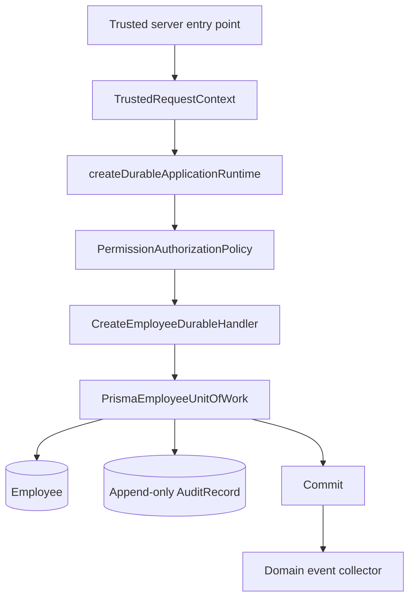

# Durable command activation

## Purpose

Slice 6H2 activates durable employee creation only through an explicit trusted server entry point. It does not activate Runtime Hire submission, add a route handler, or expose a browser mutation API.

## Server-only flow

`createDurableApplicationRuntime` is a separate composition factory. It reuses the normal application runtime for read services but adds exactly one server-owned command method: `executeDurableCreateEmployee`. It is the only location that selects a Prisma client and durable Unit of Work.

The command pipeline still authorizes `people.employee.create` before invoking its handler. The handler maps validated command data to the existing aggregate, receives tenant, actor, request, and correlation data only from `TrustedRequestContext`, and executes it through the Prisma Unit of Work. The Unit of Work inserts Employee and immutable AuditRecord data atomically, then releases domain events and inspection records after a successful commit.

## Capability disposition

| Capability | Pre-change | Post-change | Disposition |
|---|---|---|---|
| `PEOPLE.RUNTIME.DURABLE_EMPLOYEE_CREATE` | No durable composition | Active internal trusted-server capability | Migrated now |
| `PEOPLE.EMPLOYEE.CREATE.COMMAND` | Active preparation | Active preparation | Preserved |
| `PEOPLE.EMPLOYEE.SUBMIT` | Deferred hidden | Deferred hidden | Preserved |
| Runtime Hire browser action | Preparation only | Preparation only | Preserved |
| Government ID controls | Blocked/deferred | Blocked/deferred | Preserved |

## Explicit exclusions

- No browser route, server action, HTTP endpoint, or Runtime Hire action calls the durable runtime.
- No browser-supplied actor, tenant, permission, or authorization decision is accepted.
- No raw Government ID, compensation, payroll, or legacy Employee/store data enters this path.
- No durable read-model migration, event publisher, outbox, audit UI, or notification system is introduced.

## Operational notes

The Prisma client is process-local and is constructed only when the explicit durable server runtime is selected. Prisma schema/migration administration remains outside the command flow. The existing database audit trigger remains the final append-only guard against updates and deletes.
