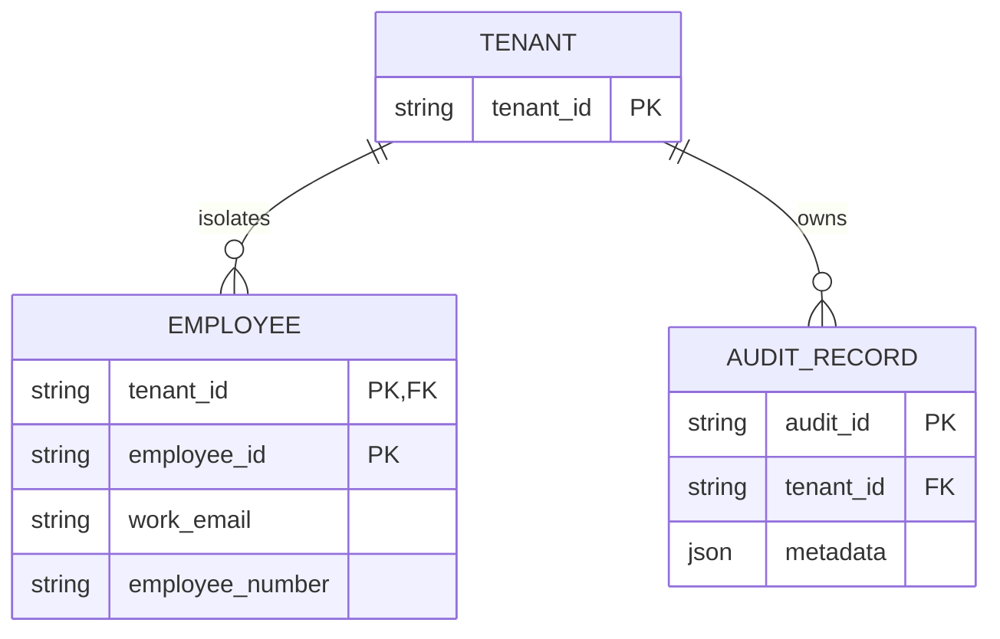

# Persistence foundation

## Purpose

This slice establishes the canonical PostgreSQL schema and Prisma Client generation boundary only. Application runtime composition continues to use the in-memory repository and Unit of Work; Runtime Hire remains preparation-only and no browser path persists an employee.

## Entity model



`Employee` maps only fields already represented by `EmployeeAggregateDraft` / `EmployeeAggregate`, plus nullable `employmentStatus`, which is an existing People concept but has no authoritative command value yet. Its absence from current commands must remain explicit in future adapters; no default status is inferred. There is no `User` table because trusted principals currently arrive from an external authentication boundary and no user aggregate exists.

## Tenant and identifier strategy

Tenant is the storage isolation root. Employee identity is the composite `(tenant_id, employee_id)`, and both employee number and work email are unique within a tenant. Future repositories must receive the tenant only from `TrustedRequestContext` / `UnitOfWorkContext`, never from browser input.

Employee IDs, employee numbers, audit IDs, timestamps, correlation IDs, and transaction IDs remain server-owned. Prisma does not generate business identifiers in this slice; future repository adapters retain the current application contracts.

## Audit strategy

`audit_records` stores the existing immutable `AuditRecord` contract. It is intentionally append-only: the initial PostgreSQL migration creates a trigger that rejects `UPDATE` and `DELETE`. Audit persistence is not wired into the current Unit of Work in this slice, so no behavior or event-release order changes yet.

## Dates and sensitive data

PostgreSQL `DATE` stores the aggregate's date-only birth and hire dates; all timestamps use `TIMESTAMPTZ(6)`. Personal contact, home-address, and emergency-contact values appear only because the current authoritative aggregate already represents them. Their authorization, retention, encryption-at-rest policy, and read-model exposure are deliberately not changed here.

Government IDs (TIN, SSS, PhilHealth, Pag-IBIG), payroll, compensation, tax, banking, leave, and benefits are excluded. The absence of Government ID columns prevents accidental persistence through this foundation.

## Development configuration

Set `DATABASE_URL` from `.env.example` to a provisioned local PostgreSQL database, then run:

```text
npx prisma format
npx prisma validate
npx prisma generate
npx prisma migrate dev --name init_persistence_foundation
```

The checked-in `20260723193000_init_persistence_foundation` migration is the initial non-destructive baseline. A PostgreSQL instance is required to apply it; no application server or browser flow needs to be running.

### Railway development provisioning

Railway PostgreSQL is the selected development database for this workspace. Prisma commands load its external encrypted connection only from the ignored local `.env`; no password, host, user, or connection string belongs in source control, command output, or this document. `.env.example` remains a credential-free template.

The initial migration was applied through `prisma migrate deploy` and `prisma migrate status` reports the schema as up to date. The migration history contains `20260723193000_init_persistence_foundation`; tenant, employee, audit, and Prisma migration-history tables are present. Tenant-scoped employee identity, employee-number, and work-email indexes were verified.

Audit immutability was verified in a rolled-back transaction: an isolated audit insert succeeded, while both update and delete attempts were rejected by `audit_records_prevent_mutation`; no temporary rows remained afterward. This verifies database protection only. Runtime persistence wiring, browser access, and production employee creation remain intentionally deferred.

For a developer's own isolated database, create a dedicated non-superuser role and database, place its encrypted connection string only in ignored `.env`, run the commands above, and verify the append-only audit trigger in a rolled-back transaction. Never use `db push`, `migrate reset`, or a shared/staging/production database for this foundation.

## Adapter status

Slice 6H1 implements `PrismaEmployeeAggregateRepository`, `PrismaEmployeeUnitOfWork`, and `PrismaAuditRecordRepository` behind the existing ports. They use an interactive Prisma transaction for employee and append-only audit inserts, then release collected domain events only after commit. They are deliberately not registered in the active application runtime; see [Prisma persistence adapter](prisma-persistence-adapter.md).

Browser submission, production employee creation, read-model migration, and runtime persistence selection remain deferred until an explicitly authorized slice. The separately controlled [development People seed](development-people-seed.md) provides only approved synthetic fixture data for the upcoming read-model migration; it does not activate any runtime read or write path.
