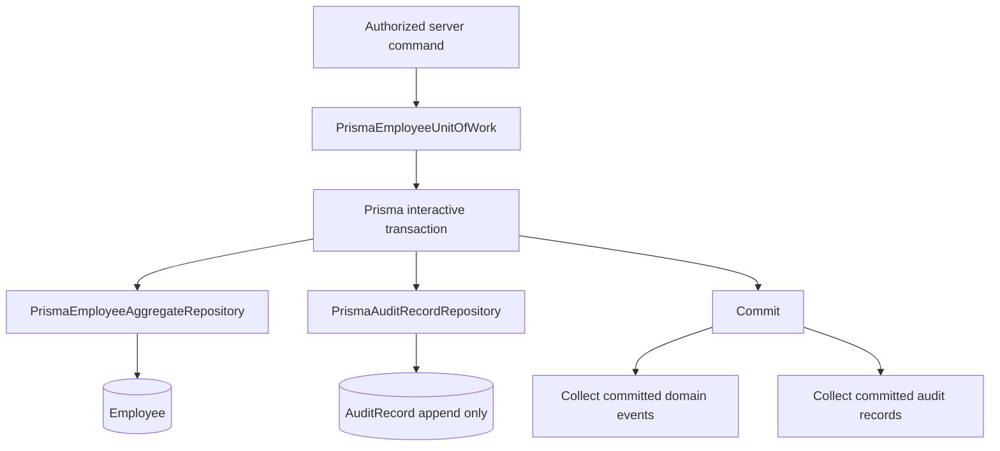

# Prisma persistence adapter and durable Unit of Work

## Purpose

Slice 6H1 adds durable, server-side implementations of the existing employee repository, Unit of Work, domain-event collection, and immutable-audit boundaries. It does not change runtime composition: the active application runtime still uses the in-memory adapter and Runtime Hire still prepares a command only.

## Durable flow

`PrismaEmployeeUnitOfWork` opens the Prisma transaction and provides only a transaction-scoped employee repository to the application operation. The adapter upserts the trusted tenant before an employee insert, scopes every lookup to the transaction tenant, normalizes work email, and maps only the existing `EmployeeAggregate` fields. Employee IDs and numbers are generated server-side; no browser-supplied identifier becomes authoritative.

Employee and immutable-audit inserts occur in the same transaction. A failed operation or audit insert rolls back both. Domain events and the existing in-memory inspection collectors receive their records only after a successful commit. This retains the post-commit release rule while preventing a durable employee write without its immutable audit evidence.

## Boundary and safety rules

- `PrismaEmployeeAggregateRepository` and `PrismaEmployeeUnitOfWork` are adapter implementations, not UI dependencies.
- `PrismaAuditRecordRepository` exposes `append` only. The database trigger continues to reject updates and deletes.
- The adapters are not registered by `createPlatformContainer` or `createApplicationRuntime` in this slice.
- Runtime Hire imports neither the Prisma adapter nor the durable Unit of Work. It remains validation and command preparation only.
- Tenant context comes exclusively from the server-owned Unit of Work context. Transaction access with a different tenant is rejected.
- Government IDs, payroll, compensation, tax, banking, permissions, session data, and browser identity are outside these contracts.

## Testing

The adapter tests use a transaction-faithful Prisma test double to verify aggregate mapping, work-email conflicts, tenant isolation, atomic employee-plus-audit behavior, rollback, post-commit event release, and the absence of Runtime Hire wiring. Railway schema, constraints, and audit-trigger behavior remain verified separately by Slice 6H0.1 operational checks.

## Activation deferred

The new durable adapters are intentionally not selected by the composition root. Slice 6H2 or an explicitly authorized future slice must decide how a trusted, authorized command selects durable persistence, with production operational monitoring and recovery rules. No browser action may activate it merely because these adapters exist.
