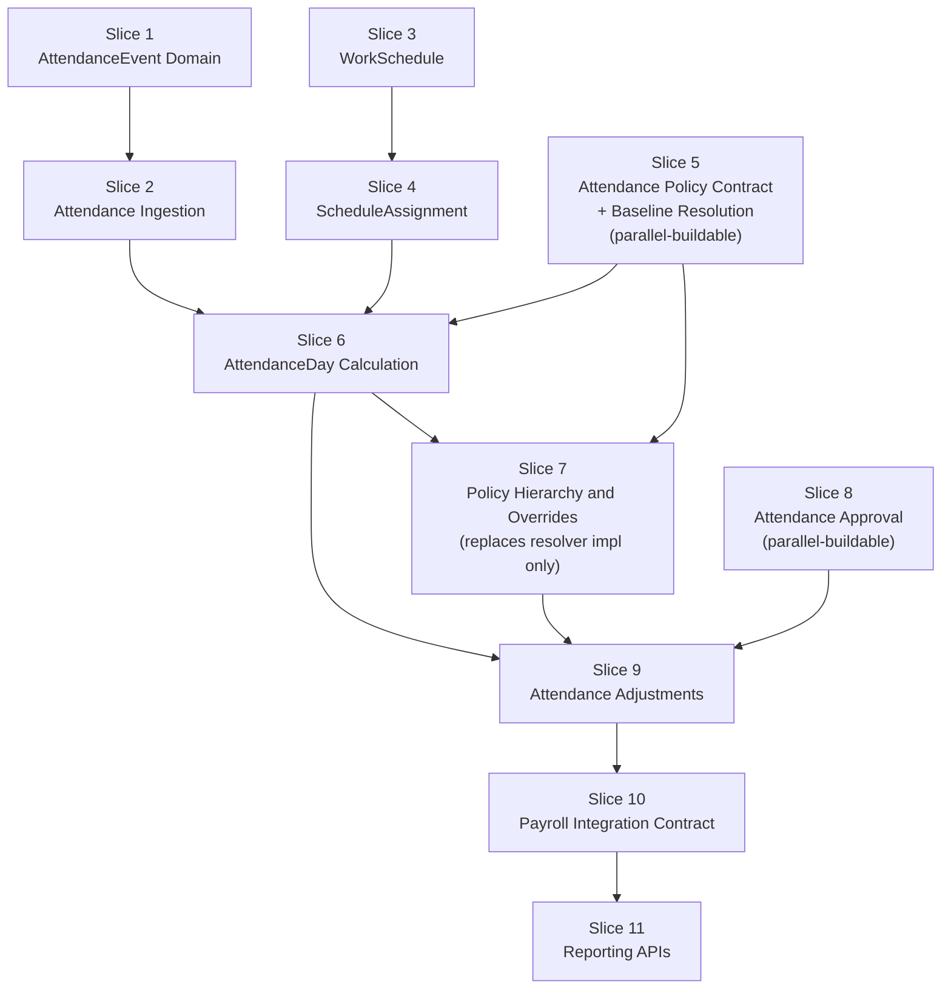

# Timekeeping Implementation Plan

| | |
|---|---|
| **Status** | Draft — planning document, no production code |
| **Governs** | Delivery of the Timekeeping bounded context |
| **Conforms to** | ADR-014 (Timekeeping Temporal and Policy Model) — **frozen, normative**, unmodified by this plan |
| **Date** | 2026-07-25 |

This is a planning document only. It contains no production code, no
migrations, no Prisma schema. Every slice below must conform to ADR-014 §17
exactly — this revision removes the one deliberate reordering an earlier
draft of this plan proposed (computing `AttendanceDay` against a temporary
placeholder policy, ahead of `AttendancePolicy` itself). That reordering is
withdrawn. Policy is established as a stable **contract** before
`AttendanceDay` is built, and the contract's *implementation* — not its
shape — is what grows from a single Tenant-wide baseline to full precedence
later. No placeholder, temporary, or hardcoded calculation policy exists
anywhere in this plan.

---

## Part 1 — Implementation Roadmap

Eleven slices, each independently reviewable and independently mergeable.
Every slice follows the file-and-directory conventions already established
for the Organization domain (`src/platform/organization/*` — ports, Prisma
adapters, in-memory adapters, UnitOfWork, structural/architecture-fitness
tests) so a reviewer familiar with `LegalEntity`/`OrgUnit`/`Assignment`
recognizes the shape immediately in `src/platform/timekeeping/*`.

### Slice 1 — AttendanceEvent Domain

**Objective.** Establish the immutable, append-only `AttendanceEvent`
record and its persistence — the foundational fact every later slice reads
from. No write service, no UI yet (Slice 2).

**Files expected.**
- `src/platform/timekeeping/attendance-event.ts` — record type + validation
- `src/platform/timekeeping/attendance-event-repository.ts` — port,
  **no `update`/`delete` method in the interface**
- `src/platform/timekeeping/prisma-attendance-event-repository.ts`
- `src/platform/timekeeping/in-memory-attendance-event-repository.ts`
- `src/platform/timekeeping/attendance-event.test.ts`
- `src/platform/timekeeping/attendance-event-structure.test.ts` —
  architecture-fitness, asserting the repository interface declares no
  mutation method (same regex-over-source-file technique as
  `legal-entity-structure.test.ts`)

**Aggregates affected.** `AttendanceEvent` (new).
**Repositories.** `AttendanceEventRepository` (append-only).
**Services.** None yet — direct repository use only.
**UI.** None.
**Tests.** Unit (validation: instant well-formed, source is a declared
channel), structural (immutability enforced by interface shape, not
convention).
**Migration (named, not written).** New `attendance_events` table:
`id`, `tenant_id`, `person_id`, `occurred_at_utc`, `received_at_utc`,
`source`, `source_ref`, `idempotency_key`, `created_at`. Unique constraint
on `(tenant_id, idempotency_key)`. Index on
`(tenant_id, person_id, occurred_at_utc)`. No update trigger. `person_id`
follows whatever reference pattern `Assignment.personId` already uses today
(soft reference, not asserted here without checking the existing migration).
**Risks.** Lowest-risk slice in the roadmap (ADR-014 Appendix C already
rates `AttendanceEvent` READY, unblocked).
**Acceptance criteria.** Repository interface has no mutation method
(structural test enforced); duplicate `idempotency_key` rejected at the
**database** level, not application logic alone; two-tenant isolation test
passes; typecheck/lint/tests green.

### Slice 2 — Attendance Ingestion

**Objective.** Build `AttendanceIngestionService` — the single write path
for every channel (ADR-014 §8) — with idempotency and per-channel source
validation, plus the first real channel end-to-end: web clock.

**Files expected.**
- `src/platform/timekeeping/attendance-ingestion-service.ts`
- `src/platform/timekeeping/attendance-ingestion-service.test.ts`
- `src/platform/timekeeping/timekeeping-runtime.ts` — composition root,
  mirrors `organization-admin-runtime.ts`
- `src/app/(app)/time/clock/page.tsx`, `.../actions.ts` — new `/time` route
  (the nav item is already reserved in AURA's left nav)
- `src/components/time/web-clock-panel.tsx`

**Aggregates affected.** `AttendanceEvent` (written via the service).
**Repositories.** `AttendanceEventRepository` (Slice 1).
**Services.** `AttendanceIngestionService` (new).
**UI.** First real Timekeeping UI: a clock-in/clock-out panel.
**Tests.** Unit (idempotency, invalid source rejection, invalid instant
rejection), integration (real Postgres round-trip, tenant isolation),
browser verification (clock in, clock out, duplicate submission is a
no-op — not an error — verified by re-submitting the same idempotency key).
**Migration.** None beyond Slice 1's table; a new `timekeeping.clock`
permission-catalog entry (data, not schema).
**Risks.** Idempotency-key collision handling under concurrent submission
(double-click / flaky mobile retry) needs explicit test coverage, not just
a happy-path test.
**Acceptance criteria.** Same-key resubmission returns the original result;
a different submission in the same second is not treated as a duplicate;
gated by `timekeeping.clock`; browser verification: clock in then clock
out produces two distinct `AttendanceEvent` rows (verified via a diagnostic
query — Slice 6 hasn't built a display yet).

### Slice 3 — WorkSchedule

**Objective.** Build the `WorkSchedule` aggregate as a versioned,
admin-managed template (ADR-014 §4.1) — no `ScheduleAssignment` binding
yet (Slice 4).

**Files expected.** The `LegalEntity` file set, same shape, new domain:
- `src/platform/timekeeping/work-schedule.ts`, `-events.ts`,
  `-repository.ts`, `-service.ts`, `-write-transaction.ts`
- `src/platform/timekeeping/prisma-work-schedule-{read,write}-repository.ts`,
  `prisma-work-schedule-unit-of-work.ts`
- `src/platform/timekeeping/in-memory-work-schedule-repository.ts`,
  `in-memory-work-schedule-unit-of-work.ts`
- `work-schedule.test.ts`, `work-schedule-service.test.ts`,
  `work-schedule-structure.test.ts`
- `src/platform/timekeeping/admin/work-schedules-admin-loader.ts`
- `src/app/(app)/settings/time/work-schedules/{page.tsx,actions.ts}`
- `src/components/settings/time/work-schedule-admin-view.tsx`

**Aggregates affected.** `WorkSchedule` (new).
**Repositories.** `WorkScheduleRepository`.
**Services.** `ScheduleService` (create/version/archive only this slice —
`assign`/`end` arrive in Slice 4).
**UI.** Settings > Time > Work Schedules admin page.
**Tests.** Unit, service, structural (a code edit creates a new version row,
never an in-place update — enforced by the repository interface shape, same
technique as Slice 1).
**Migration.** New `work_schedules` table: `id`, `tenant_id`, `code`,
`name`, `version`, shift definition, status, timezone-resolution mode. The
exact shift-definition shape (JSON column vs. normalized child rows) is an
open implementation choice **not** settled by ADR-014 — decide it during
this slice's code review, not before.
**Risks.** The shift-definition schema shape is the one real design
decision left inside this slice; flag it explicitly in the PR description
so Code Review treats it as a decision point, not an oversight.
**Acceptance criteria.** Editing a schedule creates a new version, never
mutates one already referenced by any record; archiving a version in active
use is rejected (mirrors `LegalEntity`/`Location` archive-in-use
protection).

### Slice 4 — ScheduleAssignment

**Objective.** Bind a `WorkSchedule` version to a person, effective-dated,
enforcing the cross-aggregate invariant against Organization's `Assignment`
(ADR-014 §4.2).

**Files expected.**
- `src/platform/timekeeping/schedule-assignment.ts`, `-repository.ts`
- `prisma-schedule-assignment-{read,write}-repository.ts`,
  `prisma-schedule-assignment-unit-of-work.ts`,
  `in-memory-schedule-assignment-{repository,unit-of-work}.ts`
- `schedule-assignment.test.ts`, `schedule-assignment-service.test.ts`
  (extends `ScheduleService` with `assignSchedule`/`endSchedule`)
- New "Schedule" section on the Employee profile, parallel to the existing
  Employment/Work Information tabs:
  `src/app/(app)/people/[employeeId]/schedule/page.tsx`,
  `src/components/people/profile/runtime-profile-schedule.tsx`,
  a "Change Schedule" action alongside the existing
  `src/components/people/profile/employment-actions.tsx` actions

**Aggregates affected.** `ScheduleAssignment` (new).
**Repositories.** `ScheduleAssignmentRepository`.
**Services.** `ScheduleService` (`assignSchedule`, `endSchedule` added).
**UI.** New Employee-profile "Schedule" surface.
**Tests.** Unit, service (including the cross-aggregate invariant: a
`ScheduleAssignment.effectiveFrom` outside the person's current `Assignment`
window is rejected), integration, structural (non-overlap enforced at the
database level, mirroring `Assignment`'s own exclusion constraint).
**Migration.** New `schedule_assignments` table: `id`, `tenant_id`,
`person_id`, `work_schedule_id`, `work_schedule_version`, `effective_from`,
`effective_until`, `created_at`/`by`, with a GIST/exclusion constraint on
`(tenant_id, person_id, [effective_from, effective_until))`.
**Risks.** First slice requiring a real cross-context validation call into
`OrganizationQueryService` at write time. This session's own delivery of
the Legal Entity slice found a genuine validation-**ordering** bug
(`checkPlacement` tripping a more-specific check before a less-specific
one, in a way that needed a dedicated test to isolate) — treat that as
precedent: write the ordering test explicitly, don't assume the happy path
proves it.
**Acceptance criteria.** Assigning a schedule before/after the person's
placement window is rejected with a clear, field-level error; non-overlap
enforced by the database, not just the service; browser verification:
assign a schedule, view it on the profile, end it, assign a new one.

### Slice 5 — Attendance Policy Contract and Baseline Resolution

**Objective.** Establish the **stable contract** `AttendanceDay`
calculation will depend on permanently: the resolved-policy value object
and the policy-resolver interface, with a real, explicitly configured
Tenant-wide baseline as the only implementation this slice ships. Full
Tenant→LegalEntity→Location→OrgUnit→Employee precedence is **not** built
here — that is Slice 7, against the same contract, without changing it.

This slice has no dependency on Slices 1–4; it depends only on
Organization's already-built `LegalEntity` (for statutory-floor metadata
shape) and can be built in parallel with them.

**What this slice defines.**
- The **resolved-policy value object** (`ResolvedAttendancePolicy`) —
  every field `AttendanceCalculationService` will ever need: rounding rule,
  grace period, break rules, overtime rule, tolerance rule, timezone and
  workday-boundary inputs, statutory-floor metadata (which values are
  Legal-Entity-derived floors vs. operational, per ADR-014 §6.1), a stable
  **policy version identity**, an **effective period**
  (`effectiveFrom`/`effectiveUntil` — effective-dated from day one, per
  ADR-014 §5, not retrofitted later), and a **deterministic
  serialization/hash** (`fingerprint()`) so two computations against "the
  same" policy are provably identical, and so `AttendanceDay` can persist a
  compact, verifiable reference rather than only a full copy.
- The **`AttendancePolicyResolver` interface** — the sole seam
  `AttendanceCalculationService` (Slice 6) is allowed to depend on:
  `resolve(context, personId, date) -> AttendancePolicyResolutionResult`,
  where the result is an explicit discriminated union —
  `{ kind: "resolved", policy: ResolvedAttendancePolicy }` or
  `{ kind: "configuration_incomplete", missingScope, reason }` — **never**
  a bare value that silently defaults when nothing is configured.
- The **`BaselineAttendancePolicyResolver`** — the only implementation this
  slice ships. It resolves a single, **Tenant-scoped**, **explicitly
  admin-configured** `AttendancePolicy` record — not a code constant. If no
  Tenant-scoped policy has been configured for the target tenant, it
  returns `configuration_incomplete`, not an assumed/invented default.
- The `AttendancePolicy` aggregate itself (ADR-014 §4.7's shape — `scope`
  already supports all five values `Tenant`/`LegalEntity`/`Location`/
  `OrgUnit`/`Employee` at the data level, unmodified from ADR-014), but
  this slice's write path (admin UI, `AttendancePolicyService`) only ever
  creates `Tenant`-scoped records — the other four scopes are unlocked by
  Slice 7, which extends the same aggregate's write surface, not its shape.

**Files expected.**
- `src/platform/timekeeping/attendance-policy.ts` — `AttendancePolicy`
  aggregate, `ResolvedAttendancePolicy` value object,
  `AttendancePolicyResolutionResult` discriminated union
- `src/platform/timekeeping/attendance-policy-repository.ts` — CRUD port
- `src/platform/timekeeping/attendance-policy-resolver.ts` — the resolver
  **port** (interface only)
- `src/platform/timekeeping/baseline-attendance-policy-resolver.ts` — the
  Tenant-scope-only implementation
- `src/platform/timekeeping/attendance-policy-service.ts` — admin write
  path (Tenant scope only, this slice)
- Prisma/in-memory adapters for `AttendancePolicyRepository`
- `attendance-policy.test.ts` (value-object + validation),
  `baseline-attendance-policy-resolver.test.ts` (including the
  `configuration_incomplete` path — explicit, not incidental),
  `attendance-policy-service.test.ts`
- `src/app/(app)/settings/time/attendance-policy/{page.tsx,actions.ts}` —
  Tenant-scope configuration form (no scope picker yet; Slice 7 extends
  this same page with one)
- `src/platform/timekeeping/admin/attendance-policy-admin-loader.ts`

**Aggregates affected.** `AttendancePolicy` (new, Tenant-scope write path
only).
**Repositories.** `AttendancePolicyRepository`.
**Services.** `AttendancePolicyService` (Tenant-scope create/update);
`BaselineAttendancePolicyResolver` (the resolver implementation).
**UI.** Settings > Time > Attendance Policy — single Tenant-wide
configuration form.
**Tests.** Unit (value-object validation, fingerprint determinism —
same inputs always hash identically), the `configuration_incomplete` path
explicitly tested (not just the happy path), integration, structural
(`AttendancePolicyResolver` is declared as an interface with more than one
theoretically valid implementation — i.e. nothing in
`attendance-policy-resolver.ts` couples the interface to
`BaselineAttendancePolicyResolver`).
**Migration.** New `attendance_policies` table: `id`, `tenant_id`, `scope`,
`scope_id`, `effective_from`, `effective_until`, policy values, version,
exclusion constraint per `(tenant_id, scope, scope_id, period)` — the full
five-value `scope` enum from ADR-014 §4.7, even though this slice's
application code only ever writes `Tenant`.
**Risks.** ADR-014 Open Decision §16.6 (overnight/midnight-spanning shift
date attribution) **must resolve before this slice starts** — the
workday-boundary input on `ResolvedAttendancePolicy` needs a real, decided
shape now, since Slice 6 and Slice 7 both build on it permanently.
**Acceptance criteria.**
- `AttendanceDay` (Slice 6) can depend on a stable, versioned resolved-policy
  contract that will not change shape in Slice 7.
- Every resolved policy's version and source (which `AttendancePolicy`
  record produced it) are identifiable from the value object alone.
- Missing required Tenant-level configuration produces an explicit
  `configuration_incomplete` result — never a silently assumed rule set.
- **No temporary, hardcoded, or placeholder policy value exists anywhere
  in this slice.** The baseline is a real, persisted, admin-configured
  record.
- The contract (interface + value object) is provably sufficient for
  Slice 7 to implement full precedence against, with zero changes to the
  interface's signature.

### Slice 6 — AttendanceDay Calculation

**Objective.** Build the core computation pipeline —
`AttendanceEvent` + `ScheduleAssignment` + Assignment snapshot +
**`AttendancePolicyResolver`** (Slice 5's interface, injected — never a
concrete resolver referenced directly) → `AttendanceDay`.

`AttendanceCalculationService` must not know, anywhere in its own code:
how policy precedence is resolved, where a policy was configured, whether
its source was Tenant, Legal Entity, Location, OrgUnit, or Employee, or how
a future country pack might be implemented. It depends on the
**interface** from Slice 5 only. When Slice 5's `BaselineAttendancePolicyResolver`
is later joined (Slice 7) by a `PrecedenceAttendancePolicyResolver`
implementing the same interface, this slice's code does not change — only
which implementation is wired into the composition root does.

**Files expected.**
- `src/platform/timekeeping/attendance-day.ts`, `-repository.ts`
- `src/platform/timekeeping/attendance-calculation-service.ts` — constructor
  takes `AttendancePolicyResolver` (the interface) as a dependency
- Prisma/in-memory adapters, `attendance-day.test.ts`,
  `attendance-calculation-service.test.ts`,
  `attendance-day-structure.test.ts` (asserts the snapshot fields are plain
  stored columns, never a live join back to `Assignment` — ADR-014 §5.4 —
  **and** that `attendance-calculation-service.ts` contains no reference to
  `LegalEntity`, `OrgUnit`, `Location`, `scope`, or `precedence` — the
  structural proof that it depends only on the resolver interface)
- `src/app/(app)/people/[employeeId]/attendance/page.tsx`,
  `src/components/people/profile/runtime-profile-attendance.tsx` — read-only

**Aggregates affected.** `AttendanceDay` (new).
**Repositories.** `AttendanceDayRepository`.
**Services.** `AttendanceCalculationService`.
**UI.** New read-only "Attendance" tab showing computed days (first-in,
last-out, worked minutes) — no adjustment/approval UI yet.
**Tests.** Unit (rollup math against the real baseline policy from Slice
5), integration, structural (snapshot-not-live-reference per §5.4; the
resolver-interface-only dependency described above), and an explicit test
for the **`configuration_incomplete` path**: when the resolver reports no
applicable policy, `AttendanceDay` computation is deferred with a clear,
distinct status — never silently computed against assumed values.
**Migration.** New `attendance_days` table: `id`, `tenant_id`, `person_id`,
`attendance_date`, `status` (now including a `policy_missing`/blocked state
alongside `computed`/`adjusted`/`finalized`), `legal_entity_id`/
`org_unit_id`/`location_id` (Assignment snapshot columns),
`policy_version`/`policy_fingerprint` (from Slice 5's value object — a real
reference, not a placeholder marker). Unique
`(tenant_id, person_id, attendance_date)`.
**Risks.** The `configuration_incomplete` handling path is easy to under-test
if development happens to always run against a tenant with a baseline
already configured — explicit test coverage for the missing-configuration
case is a named Acceptance Criterion precisely to prevent that.
**Acceptance criteria.** A day's `AttendanceDay` correctly reflects that
day's events under the real, Slice-5-configured baseline policy; a
late-arriving event triggers a correct recompute while `status = computed`;
snapshot fields do not change when an unrelated later `Assignment` change
occurs (§5.4); a tenant with no configured baseline produces an explicit,
visible `configuration_incomplete`/blocked state, not a silently computed
result.

### Slice 7 — Attendance Policy Hierarchy and Overrides

**Objective.** Implement the full precedence model ADR-014 §6 approved:

```
Tenant → Legal Entity → Location → OrgUnit → Employee Override
```

with the statutory-floor clamp (§6.1/§6.2) enforced for real. This slice
**replaces only the resolver implementation** wired into the composition
root — `PrecedenceAttendancePolicyResolver` alongside (not instead of)
Slice 5's `BaselineAttendancePolicyResolver` — and extends
`AttendancePolicyService`'s write path to the other four scopes.
`AttendanceDay`'s calculation contract, from Slice 6, does not change.

**Files expected.**
- `src/platform/timekeeping/precedence-attendance-policy-resolver.ts` — the
  full scope-walk + statutory-floor clamp (ADR-014 §6.3), implementing the
  **same** `AttendancePolicyResolver` interface from Slice 5
- `precedence-attendance-policy-resolver.test.ts` — precedence-walk
  correctness, floor-clamp rejection of an over-permissive override
- Extends `attendance-policy-service.ts` (Slice 5) with
  `LegalEntity`/`Location`/`OrgUnit`/`Employee`-scoped create/update
- Extends the Settings > Time > Attendance Policy page (Slice 5) with a
  scope picker (Tenant/LegalEntity/Location/OrgUnit/Employee)
- `attendance-day-calculation-contract-unchanged.test.ts` — a structural
  regression test asserting `attendance-day.ts` and
  `attendance-calculation-service.ts` are **byte-for-byte unchanged from
  their Slice 6 committed state**, except for the composition-root wiring
  file that selects which resolver implementation is active

**Aggregates affected.** `AttendancePolicy` (write path extended to all
five scopes — the aggregate's own shape, fixed in Slice 5 per ADR-014 §4.7,
is unmodified).
**Repositories.** `AttendancePolicyRepository` (unchanged).
**Services.** `AttendancePolicyService` (extended);
`PrecedenceAttendancePolicyResolver` (new, alongside the Slice 5 baseline
resolver — both remain valid implementations of the same interface).
**UI.** Settings > Time > Attendance Policy gains scope selection.
**Tests.** Unit (precedence walk, floor-clamp **rejects** an
over-permissive override rather than silently correcting it), integration,
structural (non-overlap per `(scope, scopeId)`; **the explicit
"AttendanceDay's contract did not change" proof** named above), regression
(all of Slices 1–6 green, unmodified).
**Migration.** None new — `attendance_policies` already supports every
scope (Slice 5).
**Risks.** ADR-014 Open Decision §16.3 (the exact closed list of
statutory-floor axes) **must resolve before this slice starts** — hard
precondition, matching ADR-014 Appendix E's own classification.
**Acceptance criteria.** A Location-scoped grace-period override correctly
takes precedence over the Tenant default; an attempted Location override of
the Legal-Entity-derived overtime floor is **rejected with an error**, never
silently clamped without one; the structural regression test proves
`AttendanceDay`'s and `AttendanceCalculationService`'s own files did not
change to support this slice — only a new resolver implementation and its
composition-root wiring were added.

### Slice 8 — Attendance Approval

**Objective.** Build the generic `AttendanceApproval` aggregate, routing
(frozen at request time), and decision mechanics (ADR-014 §4.6, §10) — wired
to a minimal test-double subject so the maker-checker primitive is
reviewable on its own, ahead of a real subject type (Slice 9).

This slice has no dependency on Slices 3–7; like Slice 5, it can be built
in parallel with the schedule/policy work.

**Files expected.**
- `src/platform/timekeeping/attendance-approval.ts`, `-repository.ts`
- `src/platform/timekeeping/attendance-approval-service.ts` — routing
  (resolve `Assignment.managerId` at request time, freeze it) + decide
- Prisma/in-memory adapters, `attendance-approval.test.ts`,
  `attendance-approval-service.test.ts`
- `src/app/(app)/time/approvals/page.tsx` — a pending-approvals queue,
  backed by `resolveApprovalQueue`

**Aggregates affected.** `AttendanceApproval` (new).
**Repositories.** `AttendanceApprovalRepository`.
**Services.** `AttendanceApprovalService`.
**UI.** Pending-approvals queue (necessarily thin until Slice 9 gives it a
real subject).
**Tests.** Unit (routing freeze, self-approval rejection, decision
immutability on replay), **behavioral test proving §10's core claim**: a
simulated manager change after routing does not reassign a pending
approval, integration.
**Migration.** New `attendance_approvals` table: `id`, `tenant_id`,
`subject_type`, `subject_id`, `approver_id`, `decision`, `decided_at`,
routed-context snapshot columns.
**Risks.** This slice is inherently hard to demo end-to-end without a real
subject type — its Acceptance Checklist is deliberately narrower
(service-level and integration-verified); full browser verification of the
approval flow is explicitly deferred to Slice 9, not skipped.
**Acceptance criteria.** Routing freezes `approverId` at creation, verified
against a test double whose "current manager" changes after routing;
self-approval rejected; a decided approval is immutable and idempotent on
replay.

### Slice 9 — Attendance Adjustments

**Objective.** Build `AttendanceAdjustment`, wire it as `AttendanceApproval`'s
first real subject type, and complete the correction workflow end-to-end:
propose → approve/reject → apply → recompute. Slice 8's queue becomes fully
demonstrable here.

**Files expected.**
- `src/platform/timekeeping/attendance-adjustment.ts`, `-repository.ts`
- `src/platform/timekeeping/attendance-adjustment-service.ts` — propose
  (creates the `AttendanceApproval`), apply (on approval, triggers
  `AttendanceCalculationService` recompute)
- Prisma/in-memory adapters, `attendance-adjustment.test.ts`,
  `attendance-adjustment-service.test.ts`
- "Request Correction" action on the Attendance tab (Slice 6); wires the
  Slice 8 approvals queue to real adjustment requests

**Aggregates affected.** `AttendanceAdjustment` (new); `AttendanceDay`
(modified — recompute on apply, using the same `AttendanceCalculationService`
contract from Slice 6/7, unchanged); `AttendanceApproval` (consumed, not
modified).
**Repositories.** `AttendanceAdjustmentRepository`.
**Services.** `AttendanceAdjustmentService`.
**UI.** "Request Correction" + a fully functional approvals queue.
**Tests.** Unit, integration (the full propose → approve → apply →
recompute flow, against the real precedence-resolved policy from Slice 7),
**browser verification — the first full end-to-end Timekeeping flow in the
roadmap**: clock in/out (Slice 2) → view computed day (Slice 6) → request a
correction → approve as the routed approver → see the day update.
Regression: Slices 1–8 suites still green.
**Migration.** New `attendance_adjustments` table: `id`, `tenant_id`,
`attendance_day_id`, `adjustment_type`, `reason`, `requested_by`, `status`,
`approval_id` reference.
**Risks.** Highest integration risk in the roadmap so far — the first slice
touching five aggregates' worth of prior work in one flow. Recommend the
most thorough browser-verification pass of the whole plan here, consistent
with this session's own finding that multi-step flows (not single-field
CRUD) are where real defects surfaced during the Legal Entity delivery.
**Acceptance criteria.** The full flow works in the browser; a
`finalized`-day rejection path exists and is tested via a repository-level
test double (real `finalized` status isn't reachable until Slice 10 builds
the lock command — note this explicitly rather than pretending it's
end-to-end tested here).

### Slice 10 — Payroll Integration Contract

**Objective.** Build `PayableAttendanceQueryService` and
`AttendanceDayLockService` (ADR-014 §11) — the entire Timekeeping-side
Payroll contract — using a test double standing in for "a Payroll caller,"
per ADR-014 §17 step 6, since Payroll itself does not exist yet.

**Files expected.**
- `src/platform/timekeeping/payable-attendance-query-service.ts`
- `src/platform/timekeeping/attendance-day-lock-service.ts`
- `src/platform/timekeeping/test-doubles/payroll-caller.ts` — the explicit
  stand-in for "a Payroll caller," used only in tests
- `payable-attendance-query-service.test.ts`,
  `attendance-day-lock-service.test.ts`,
  `payroll-boundary-structure.test.ts` — architecture-fitness, asserting
  `PayableAttendanceQueryService` exposes no write method and that nothing
  simulating "Payroll" in the test suite ever imports
  `TimekeepingQueryService` (same technique as
  `legal-entity-structure.test.ts`'s `TransferInput` check)
- Optional: `src/app/(app)/settings/time/attendance-lock-diagnostics/page.tsx`
  — a manual lock/unlock diagnostic admin page, mirroring the existing
  "Assignment Diagnostics" pattern, for testing before real Payroll exists

**Aggregates affected.** `AttendanceDay` (modified — `finalized`/unlocked
transitions, `locked_by_cutoff_id`/`locked_at` columns).
**Repositories.** None new (uses `AttendanceDayRepository`).
**Services.** `PayableAttendanceQueryService`, `AttendanceDayLockService`.
**UI.** Optional diagnostics page only — no end-user UI.
**Tests.** Unit, integration (all-or-nothing batch lock, unlock requires a
`reason`, correct events emitted), **architecture-fitness enforcing the
forbidden-access rule structurally** (§11.2), regression.
**Migration.** Column addition to `attendance_days`:
`locked_by_cutoff_id`, `locked_at`; no new table.
**Risks.** Speculative against a contract, not a real consumer yet —
mitigated by ADR-014 §11 already being a reviewed, frozen contract rather
than a guess made at this slice.
**Acceptance criteria.** Batch lock is all-or-nothing per cutoff; unlock
requires a reason and is audited; the structural test proves no write
access beyond lock/unlock is reachable from a simulated Payroll caller;
`attendance.day.finalized`/`attendance.day.unlocked` events emitted
correctly.

### Slice 11 — Reporting APIs

**Objective.** Expose the read-only Reporting-facing consumer surface
(ADR-014 Appendix F) — **reusing `PayableAttendanceQueryService` directly**,
per Appendix F's explicit decision that Reporting and Analytics use the
same restricted surface as Payroll, not a new one. This slice's real work
is consumer-facing: pagination for large populations and the actual UI.

**Files expected.**
- `src/app/(app)/reports/attendance/page.tsx` — new Reports subpage
- `src/platform/timekeeping/admin/attendance-reporting-loader.ts` — a thin,
  paginated loader calling `PayableAttendanceQueryService`
- `attendance-reporting-loader.test.ts`,
  `reporting-boundary-structure.test.ts` — architecture-fitness, asserting
  this loader imports only `PayableAttendanceQueryService`, never
  `TimekeepingQueryService`

**Aggregates affected.** None new — pure read consumer.
**Repositories.** None new.
**Services.** None new (reuses Slice 10's `PayableAttendanceQueryService`).
**UI.** New Reports > Attendance page.
**Tests.** Integration (pagination correctness against a seeded large
dataset), browser verification, structural (import-boundary check above).
**Migration.** None.
**Risks.** Lowest architectural risk in the roadmap — no new aggregate, the
contract is already frozen (Slice 10). The real risk is scale (pagination
correctness), not domain complexity.
**Acceptance criteria.** Reports > Attendance renders correctly for a
seeded population; structural test confirms the forbidden import never
appears; pagination verified against a large synthetic dataset.

---

## Part 2 — Implementation Order



**Why this order minimizes risk:**

1. **Foundation before behavior.** Slices 1–4 build the two data sources
   every later computation reads (`AttendanceEvent`, `ScheduleAssignment`)
   with no computation logic yet — each is independently testable against a
   narrow, well-understood surface, exactly the discipline ADR-014 §17
   itself calls for.
2. **Policy is a contract before it is a calculation input.** Slice 5
   fixes the shape `AttendanceDay` calculation depends on — permanently —
   before Slice 6 is built against it. This is the correction this revision
   makes: an earlier draft of this plan computed `AttendanceDay` against a
   temporary placeholder and back-filled real policy afterward. That is
   withdrawn. The contract now exists first, exactly matching ADR-014 §17's
   own stated order ("nothing downstream can be computed correctly without
   [policy] existing first"), and the baseline resolver that ships with it
   is a real, admin-configured Tenant policy — never a code constant.
3. **Precedence (7) is additive to Calculation (6), not a rewrite of it.**
   Because Slice 6 depends only on the `AttendancePolicyResolver`
   *interface* from Slice 5, Slice 7 can swap in full precedence — the
   architecturally hardest logic in the entire domain (statutory floors,
   five-level scope walk) — as a pure implementation swap, proven by an
   explicit structural regression test that `AttendanceDay`'s and
   `AttendanceCalculationService`'s own files are unchanged. This is a
   direct, deliberate application of dependency inversion to de-risk the
   single most complex slice in the roadmap.
4. **Approval is decoupled from Adjustment.** Slice 8 has no dependency on
   Slices 3–7, so it can be built in parallel if Slice 5, 6, or 7 stalls on
   an open decision (§16.3, §16.6) — the roadmap does not go idle waiting
   on a single blocked slice.
5. **The highest-integration-risk slice (9) sits after every aggregate it
   touches is independently proven**, not before — by Slice 9,
   `AttendanceEvent`, `ScheduleAssignment`, `AttendanceDay`, the full
   `AttendancePolicy` precedence model, and `AttendanceApproval` have each
   already passed their own review gate in isolation, so Slice 9's review
   is about *wiring*, not *five new domain concepts at once*.
6. **The Payroll contract (10) is last among the "real" domain slices**, so
   it is specified and tested against a stable, fully-built `AttendanceDay`
   — under real, precedence-resolved policy, not a baseline stand-in — even
   though Payroll itself doesn't exist yet.
7. **Reporting (11) is genuinely last**, because it depends on nothing but
   an already-frozen read contract (Slice 10) — it carries the least risk
   of the whole roadmap and is not worth sequencing earlier.

This order **conforms to ADR-014 §17**: policy exists before a correct
calculation is attempted (§17's own ordering constraint), schedule and
event foundations precede calculation, adjustment/approval follow
calculation, and the Payroll boundary is built last among domain slices,
against a stable foundation, exactly as §17 specifies.

---

## Part 3 — Test Strategy

| Slice | Unit | Integration | Browser Verification | Architecture Fitness | Regression Coverage |
|---|---|---|---|---|---|
| 1. AttendanceEvent Domain | Validation (instant, source) | Real-Postgres round-trip, tenant isolation | — (no UI yet) | No mutation method on the repository interface | N/A (first slice) |
| 2. Attendance Ingestion | Idempotency, invalid source/instant | Round-trip via the service, tenant isolation | Clock in, clock out, duplicate resubmission is a no-op | Permission gate (`timekeeping.clock`) enforced server-side | Slice 1 suite green |
| 3. WorkSchedule | Validation, versioning (edit = new version) | Real-Postgres CRUD | Create, edit (new version), archive, archive-in-use rejection | No update path to a referenced version | Slices 1–2 green |
| 4. ScheduleAssignment | Cross-aggregate invariant (window check), overlap rejection | Real-Postgres, cross-service call to `OrganizationQueryService` | Assign, view on profile, end, reassign | Non-overlap enforced at the database, not just the service | Slices 1–3 green |
| 5. Attendance Policy Contract + Baseline Resolution | Value-object validation, fingerprint determinism | Baseline resolution against a real configured record | Admin: configure the Tenant baseline | Resolver is a genuine interface, not coupled to one implementation | Slices 1–4 green (independent — may also land before them) |
| 6. AttendanceDay Calculation | Rollup math against the real baseline policy | Multi-event day, late-arriving-event recompute, `configuration_incomplete` handling | View computed Attendance tab | Snapshot fields never live-join `Assignment` (§5.4); calculation service has zero scope/precedence references | Slices 1–5 green |
| 7. Policy Hierarchy and Overrides | Precedence walk, floor-clamp rejection | Multi-scope policy resolution | Admin: scope a policy below Tenant, see it applied | Non-overlap per `(scope, scopeId)`; **`AttendanceDay`/`AttendanceCalculationService` files unchanged from Slice 6** | Slices 1–6 green, byte-for-byte unchanged where asserted |
| 8. Attendance Approval | Routing freeze, self-approval rejection, decision immutability | Approval lifecycle against a test-double subject | Deferred to Slice 9 (no real subject yet) | Manager-change-after-routing does not reassign (behavioral proof of §10) | Slices 1–7 green |
| 9. Attendance Adjustments | Propose/apply validation | Full propose→approve→apply→recompute against real precedence-resolved policy | **Full end-to-end flow**: clock in/out → view day → request correction → approve → day updates | Locked-day rejection path (test-double status) | Slices 1–8 green |
| 10. Payroll Integration Contract | Lock/unlock preconditions | All-or-nothing batch lock, unlock-requires-reason | Diagnostics page (if built): manual lock/unlock | No write access beyond lock/unlock reachable from a simulated Payroll caller | Slices 1–9 green |
| 11. Reporting APIs | Pagination boundary conditions | Large-population pagination | Reports > Attendance renders correctly | Loader imports only `PayableAttendanceQueryService` | Slices 1–10 green |

Every slice's full run also includes the existing platform-wide suite
(`npx tsc --noEmit`, `npx eslint .`, `npx vitest run`) — a Timekeeping slice
introducing a regression anywhere in People/Organization/Settings is treated
identically to a regression within Timekeeping itself.

---

## Part 4 — Review Gates (Slice Completion Protocol)

Every slice, without exception, ends with the same five gates, in order.
**No slice proceeds until the previous slice's gates are all passed and
explicitly signed off** — this applies to the dependency graph in Part 2 as
much as to strict numeric order: Slice 5 or Slice 8 may start before
earlier-numbered slices finish (both are parallel-buildable), but Slice 6
does not start until Slices 2, 4, **and** 5 have each passed all five gates,
Slice 7 does not start until Slice 6 has, and Slice 9 does not start until
Slices 6, 7, **and** 8 all have.

1. **Architecture Review.** Confirms the slice conforms to ADR-014 and to
   this plan's own Part 1 description for that slice — same aggregates,
   same files, same boundaries. Any deviation (a new file outside the named
   list, a field ADR-014 didn't specify) is either justified in the PR
   description or the PR is not this slice. For Slice 7 specifically, this
   gate includes verifying the structural regression test proving
   `AttendanceDay`/`AttendanceCalculationService` did not change.
2. **Code Review.** Standard review against AURA's existing engineering
   principles (Rule of Three, no speculative abstraction, existing
   ports/Prisma/in-memory pattern followed exactly).
3. **Browser Verification.** Every scenario named in that slice's
   Acceptance Criteria, run in a real browser against the real dev stack —
   with the same rigor this session's own Legal Entity delivery required:
   root-cause every failure (script bug vs. production bug) with evidence
   (URL, console, network, DOM state, screenshot) before writing a fix, and
   restart verification from the top of the slice's scenario list after any
   fix, script or production.
4. **Test Review.** The full platform suite (typecheck, lint, unit,
   integration, structural) plus the slice's own new tests, all green, zero
   regressions — confirmed by an actual run, not assumed from a prior
   slice's green state.
5. **Acceptance Checklist.** Each Acceptance Criteria bullet from that
   slice's Part 1 entry, checked off individually against evidence (a
   passing test name, a screenshot, a query result) — not a single
   "looks good" sign-off.

---

## Part 5 — Quality Gates

Every slice, with zero exceptions, must satisfy all seven before it is
considered mergeable — identical to the standard this session's own Legal
Entity delivery was held to:

- ✓ **TypeScript clean** — `npx tsc --noEmit -p .` reports zero errors.
- ✓ **ESLint clean** — `npx eslint .` reports zero new errors (pre-existing,
  unrelated warnings are not this slice's responsibility to fix).
- ✓ **Tests passing** — the full suite, not just the new slice's tests.
- ✓ **Architecture fitness passing** — every structural test named in Part
  1/Part 3 for that slice, plus the full existing structural suite.
- ✓ **Browser verification passing** — every scenario in that slice's
  Acceptance Criteria, in a real browser, with root-caused evidence for any
  failure encountered along the way.
- ✓ **No unintended migrations** — exactly the tables/columns named in that
  slice's "Migration" field, nothing from a future slice pulled forward.
- ✓ **No unrelated changes** — a `git status`/`git diff` review confirming
  only the files named in that slice's "Files expected" list (plus
  necessarily-touched call sites) are included.

---

## Part 6 — Risk Register

| Risk | Probability | Impact | Mitigation |
|---|---|---|---|
| Open decisions (§16.3 statutory-floor axes; §16.6 overnight-shift attribution) remain unresolved when Slices 5–7 are due to start | Medium | High — blocks the slice outright | Resolve as a fast-follow decision **before** the blocked slice's kickoff, not during it; Slice 8 can proceed in parallel so the roadmap doesn't go idle |
| Slice 5's contract (interface + value object) turns out insufficient once Slice 7's real precedence logic is implemented, forcing a signature change | Low–Medium | High — would mean Slice 6 was built against the wrong contract | Slice 5's Acceptance Criteria explicitly requires proving contract-sufficiency for Slice 7 before Slice 5 is accepted; if a gap is found only during Slice 7, that is itself evidence Slice 5's review gate was insufficiently rigorous, not a normal/expected occurrence |
| Browser-verification script bugs mistaken for production bugs, or the reverse | High — directly evidenced this session, which needed 14 verification runs on the Legal Entity slice to separate real defects from selector/timing bugs | Medium — wastes review time; risks a wrong "fix" | Apply the same root-cause-first discipline used in that delivery: capture URL/console/network/DOM evidence and classify before writing any fix |
| Dev-server first-compile latency causing false-negative browser verification on every new route this plan introduces (Slices 2, 4, 6, 8, 11) | High | Low–Medium — flaky verification, not a real defect | Wait on real navigation/state signals (URL change, element appearance), never a fixed timeout — the exact fix this session already had to apply twice on the Legal Entity slice |
| The `configuration_incomplete` path (Slice 5/6) is under-tested because development environments typically already have a baseline configured | Medium | Medium — a real tenant with no configured policy would silently degrade instead of failing clearly | Named explicitly as a required test in both Slice 5 and Slice 6's Acceptance Criteria, not left implicit |
| Cross-aggregate invariant validation-ordering bugs (Slice 4's window check, Slice 9's lock-state check) | Medium — directly evidenced by this session's own `checkPlacement` ordering issue on the Legal Entity slice | Medium — wrong error surfaced, not silently wrong data | Write the validation-ordering test explicitly for each cross-aggregate check, not just the happy path |
| High-volume ingestion (ADR-014 §15) not stress-tested until real device integration | Medium | High — production incident under real load | Slice 2 includes a synthetic-volume load test for the idempotent append-only write path, even before biometric/kiosk channels exist |
| Scope creep — a slice quietly absorbing a deferred Appendix D/E item (e.g. project-costing fields added to `AttendanceDay` "while in there") | Medium | Medium — violates the frozen ADR without a formal amendment | Architecture Review gate explicitly checks the PR against the slice's named file/aggregate list; anything outside it needs its own justification or its own slice |
| Migration sequencing across 6+ new tables over 11 slices | Low | High if mishandled — a broken migration blocks every later slice | Every slice's migration is additive-only (new table or nullable column); never alters a prior slice's already-shipped migration, mirroring the Legal Entity backfill's own "no permanent nullable state, no rewriting a shipped migration" discipline |

---

This plan contains no production code, no migrations, and no Prisma schema.
Slice 1 is the first artifact that may contain any of the three, and only
after this plan itself is reviewed and accepted.
